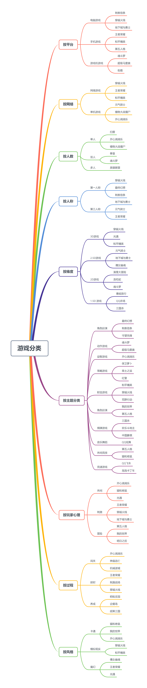

# Homework 1 - 游戏分类与热点探索

> 壹八叁肆贰零贰壹 Guo Jin

### 使用思维导图描述游戏的分类

### 结合手机游戏市场的下载量与排名等数据，结合游戏分类图，描述游戏市场的热点

游戏榜（2020-09-21）

|      | 酷安       | 一加软件商店 | OPPO软件商店 |
| ---- | ---------- | ------------ | ------------ |
| 1    | 王者荣耀   | 和平精英     | 王者荣耀     |
| 2    | 和平精英   | 明日之后     | 和平精英     |
| 3    | 球球大作战 | 梦幻西游     | 迷你世界     |
| 4    | 欢乐斗地主 | 倩女幽魂     | 明日之后     |
| 5    | 阴阳师     | 开心消消乐   | 我的世界     |
| 6    | 英雄杀     | 波克捕鱼     | 梦幻西游     |
| 7    | 炉石传送   | 问道         | 穿越火线     |
| 8    | QQ 飞车    | 光遇         | 倩女幽魂     |
| 9    | 皇室战争   | 新神魔大陆   | 问道         |
| 10   | 部落冲突   | 趣游捕鱼     | 开心消消乐   |

* 各个厂商的软件商店的排行差距比较大，不排除其中一些游戏是通过广告方式上榜的。总得来说，热门游戏大多为 3D 类型的网络游戏，通常具有魔幻或者卡通色彩，并且游戏过程多为即时性。

* 3D 类型的网络游戏是由网络速度和手机性能的快速发展推动形成的趋势；而魔幻和卡通寄托了人们对虚拟世界的精神寄托；游戏过程多为即时性是因为随着人们网络游戏情商的提高，人们厌恶了「氪金就可超神」、「24 小时在线就可无敌」的游戏模式。
* 关于游戏主题，休闲游戏比较受欢迎。
* 游戏收入的来源有两大方面，一方面是在游戏中通过销售皮肤、装备等游戏商品来获得收入，另一方面是通过在游戏中插入广告或与其他品牌联名来获得收入。通常流量较大的游戏会通过销售游戏商品或与其他品牌联名来获利，小型游戏大多是通过插入广告来获利。

