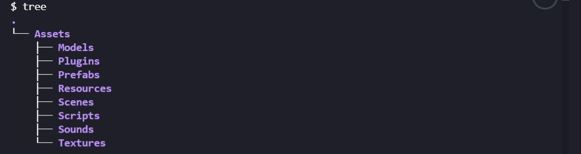
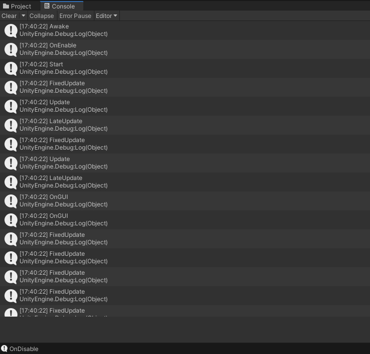
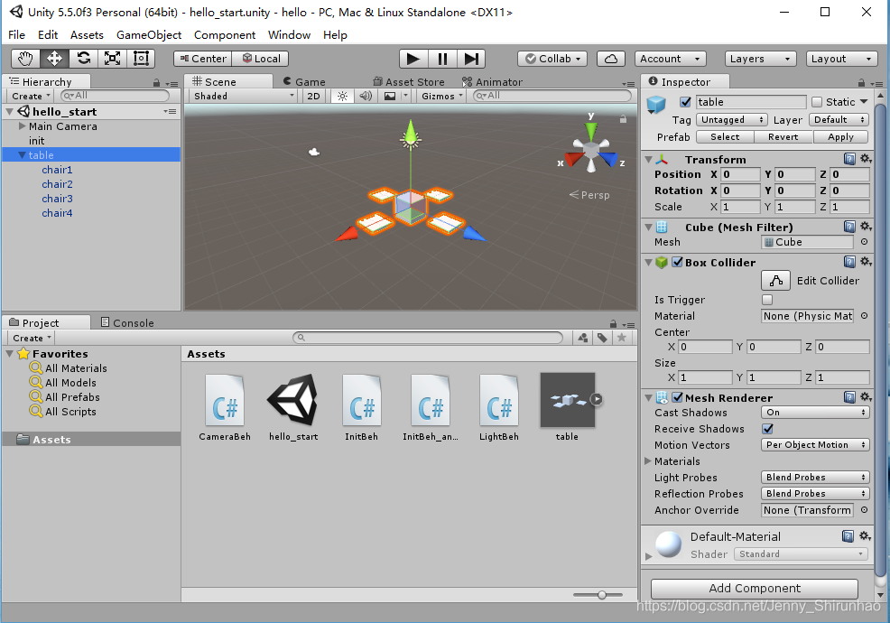
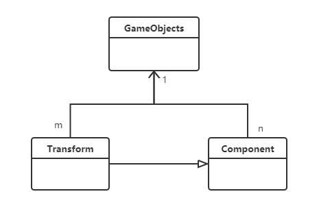
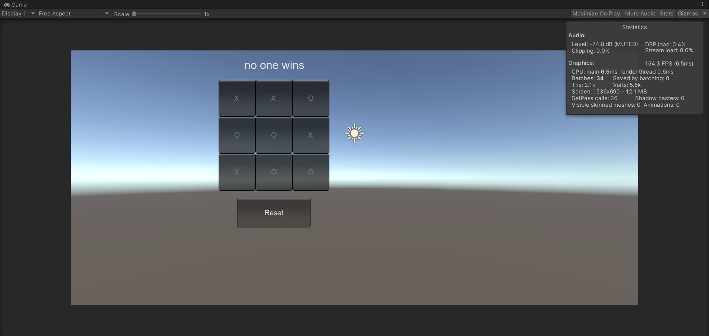
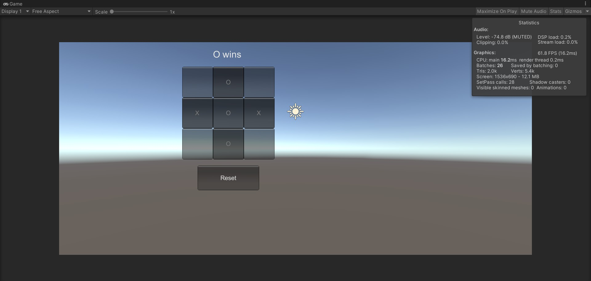

# 3D 游戏编程 ｜ 离散仿真引擎基础-作业

> 壹八叁肆贰零贰壹 Guo Jin

## 简答题

### 解释 游戏对象（GameObjects） 和 资源（Assets）的区别与联系

* 游戏对象
  * 游戏对象是游戏场景中的基本元素，是具有一定属性与功能的实例，直接出现在游戏场景中。
  * 游戏对象是一种容器。它们是空盒，能够容纳各种具有特定属性的组件。游戏对象是资源整合的具体表现。
  * 游戏对象包括游戏角色、敌人、场景、摄像机等
* 资源
  * 资源是自己制作或从外部下载的素材，在创作游戏时可以重复使用资源。
  * 有些资源是用来修饰对象的部件，同一个资源可以被多个游戏对象使用。
  * 有些资源是用来作为模板，通过模版实例化成具体的游戏对象。
  * 资源包括三维模型、音频文件、图像、脚本、预设、场景、声音等。
* 联系
  * 游戏对象可以使用资源，同时资源也可以被实例化为对象。资源可以作为游戏对象创建的模板或者一部分，而游戏对象可以被保存为资源以重复使用。游戏对象由各种资源整合而成，是资源的实例化和具体表现，也可以被预设为资源而作为模板，从而实现重复利用
  * 同一资源可以供不同的游戏对象使用，来完成对游戏对象属性的改变和对场景的修改和完善

### 下载几个游戏案例，分别总结资源、对象组织的结构（指资源的目录组织结构与游戏对象树的层次结构）

资源的目录组织结构



- Models 模型文件
- Plugins 主要是 DLL 的外部插件文件
- Prefabs 预储存文件
- Resources 动态加载的资源文件
- Scenes 场景文件
- Scripts 脚本代码文件
- Sounds 音效文件
- Textures 所有的贴图

游戏对象树的层次结构

* 游戏对象树层次视图包含了每一个当前场景的所有游戏对象。这些游戏对象是资源文件的实例，如3D模型和其他预制物体的实例。
* 在层次结构视图中可以选择对象和生成对象。并且当在场景中增加或者删除对象，层次结构视图中相应的对象则会随之发生变化。
* 在层次视图拖动某个游戏对象到另一个之上，该游戏对象即可成为另一个对象的子对象，它会继承父对象的移动和旋转属性。

### 编写一个代码，使用 debug 语句来验证 MonoBehaviour 基本行为或事件触发的条件

- 基本行为包括 Awake() Start() Update() FixedUpdate() LateUpdate()
- 常用事件包括 OnGUI() OnDisable() OnEnable()

```c#
using System.Collections;
using System.Collections.Generic;
using UnityEngine;

public class testBeh : MonoBehaviour
{
    void Awake() {
        Debug.Log ("Awake");
    }

    // Start is called before the first frame update
    void Start() {
        Debug.Log ("Start");
    }

    // Update is called once per frame
    void Update () {
        Debug.Log ("Update");
    }
 
    void FixedUpdate() {
        Debug.Log ("FixedUpdate");
    }
 
    void LateUpdate() {
        Debug.Log ("LateUpdate");
    }
 
    void OnGUI() {
        Debug.Log ("OnGUI");
    }
 
    void OnDisable() {
        Debug.Log ("OnDisable");
    }
 
    void OnEnable() {
        Debug.Log ("OnEnable");
    }
}
```

测试结果



函数执行顺序

> Awake ->OnEable-> Start -> FixedUpdate-> Update  -> LateUpdate ->OnGUI ->OnDisable ->OnDestroy

### 查找脚本手册，了解 GameObject，Transform，Component 对象

- 分别翻译官方对三个对象的描述（Description）

  - GameObjects

    > 统一场景中的基本对象。场景包含游戏的环境和菜单。将每个唯一的场景文件视为一个独特个体。在每个场景中，放置环境、障碍物、装饰物等，最终一部分一部分地完成游戏的设计和构建。

  - Transform

    > 变换确定了场景中每个物体的位置、旋转和缩放。

  - Component

    > 组件是一切附加到游戏物体的基类。

- 描述下图中 table 对象（实体）的属性、table 的 Transform 的属性、 table 的部件

  

  - 本题目要求是把可视化图形编程界面与 Unity API 对应起来，当你在 Inspector 面板上每一个内容，应该知道对应 API。
  - 例如：table 的对象是 GameObject，第一个选择框是 activeSelf 属性。

  > table 的对象是 GameObject，第一个选择框是 activeSelf 属性，第二个文本框是对象名称，第三个选择框为 static 属性。
  >
  > Transform 的属性有位置、旋转、比例。
  >
  > table 的部件有 Transform, Mesh Filter, Box Collider, Mesh Renderer, Default-Material。

* 用 UML 图描述 三者的关系



### 资源预设（Prefabs）与 对象克隆 (clone)

- 预设（Prefabs）有什么好处？
  - 预设有利于资源重用，减少工作量，避免多次重复地构建对象。
  - 当需要重复用到一个对象或者需要重复用到一组数据时，可以预设一个对象作为模板承担相同的属性，之后可以重复使用该对象。
  
- 预设与对象克隆 (clone or copy or Instantiate of Unity Object) 关系？
  - 预设与预设产生的对象是相互联系的，当修改预设时，由它实例化产生的多个对象也会跟着变化。
  - 克隆与克隆产生的对象是相互独立的，当修改克隆时，由它实例化产生的各个对象不会发生变化。
  
- 制作 table 预制，写一段代码将 table 预制资源实例化成游戏对象

    - 先制作好 Table 对象

    - 然后将 Table 拖动到 Assets 中形成预制资源

    - 删除 Table 对象

    - 编写以下代码

        ```c#
        using System.Collections;
        using System.Collections.Generic;
        using UnityEngine;
         
        public class InitBeh : MonoBehaviour {
        	// Use this for initialization
        	void Start () {
                Debug.Log("start!");
                Object temp = Resources.Load("desk");
                GameObject cube = Instantiate(temp) as GameObject;
         
                cube.transform.position = new Vector3(0, Random.Range(5, 7), 0);
                cube.transform.parent = this.transform;
        	}
        	
        	// Update is called once per frame
        	void Update () {
        		
        	}
        }
        ```

    - 创建新的空对象，将代码脚本添加到对象中

    - 运行成功

## 编程实践，小游戏

- 游戏内容： 井字棋 或 贷款计算器 或 简单计算器 等等
- 技术限制： 仅允许使用 **[IMGUI](https://docs.unity3d.com/Manual/GUIScriptingGuide.html)** 构建 UI
- 作业目的：
  - 了解 OnGUI() 事件，提升 debug 能力
  - 提升阅读 API 文档能力

#### 编写代码

* 声明变量

    * turn 表示轮次，O 先开始
    * empty 表示空格数量
    * matrix 表示棋牌

    ```c#
    private int turn = 1;
    private int empty = 9;
    private int[,] matrix = new int[3, 3];
    ```

* 开始函数

    * 开始函数调用了重置函数

    ```c#
    // Start is called before the first frame update
    void Start () {
        Reset ();
    }
    ```

* 重置函数

    * 把 turn 赋值为1
    * 把 empty 赋值为 9
    * 把 matrix 分别赋值为 0

    ```c#
    void Reset() {
        turn = 1;
        empty = 9;
        for (int i = 0; i < 3; ++i) {
            for (int j = 0; j < 3; ++j) {
                matrix[i,j] = 0;
            }
        }
    }
    ```

* 判断胜负函数

    * 检查横向
    * 检查纵向
    * 检查斜向
    * 检查是否平局

    ```c#
    // Decide if the game is over
    int check() {
        // The transverse
        for (int i = 0; i < 3; ++i) {
            if (matrix[i,0] != 0 && matrix[i,0] == matrix[i,1] && matrix[i,1] == matrix[i,2]) {
                return matrix[i,0];
            }
        }
        // The longitudinal
        for (int j = 0; j < 3; ++j) {
            if (matrix[0,j] != 0 && matrix[0,j] == matrix[1,j] && matrix[1,j] == matrix[2,j]) {
                return matrix[0,j];
            }
        }
        // The oblique
        if (matrix[1,1] != 0 &&
            matrix[0,0] == matrix[1,1] && matrix[1,1] == matrix[2,2] ||
            matrix[0,2] == matrix[1,1] && matrix[1,1] == matrix[2,0]) {
            return matrix[1,1];
        }
        if (empty == 0) {
            return 3;
        } else {
            return 0;
        }
    }
    ```

* 图形界面函数

    ```c#
    void OnGUI() {
        GUI.skin.button.fontSize = 20;
        GUI.skin.label.fontSize = 30;
        if(GUI.Button(new Rect(450,400,200,80), "Reset")) {
            Reset();
        }
    
        int result = check();
        if(result == 1) {
            GUI.Label(new Rect(500, 20, 100, 50), "O wins");
        } else if (result == 2) {
            GUI.Label(new Rect(500, 20, 100, 50), "X wins");
        } else if (result == 3) {
            GUI.Label(new Rect(470, 20, 200, 50), "no one wins");
        }
    
        for(int i = 0; i < 3; ++i) {
            for(int j = 0; j < 3; ++j) {
                if (matrix[i, j] == 1) 
                    GUI.Button(new Rect(i * 100 + 400, j * 100 + 80, 100, 100), "O");
                if (matrix[i, j] == 2) 
                    GUI.Button(new Rect(i * 100 + 400, j * 100 + 80, 100, 100), "X");
                if(GUI.Button(new Rect(i * 100 + 400, j * 100 + 80, 100, 100), "")) {
                    if(result == 0) {
                        if (turn == 1)
                            matrix[i, j] = 1;
                        if (turn == 2)
                            matrix[i, j] = 2;
                        --empty;
                        if(empty%2 == 1) {
                            turn = 1;
                        } else {
                            turn = 2;
                        }
                    }
                }
            }
        }
    }
    ```

* 完整代码

    ```c#
    using System.Collections;
    using System.Collections.Generic;
    using UnityEngine;
    
    public class TicTacToe : MonoBehaviour {
    
        private int turn = 1;
        private int empty = 9;
        private int[,] matrix = new int[3, 3];
    
        // Start is called before the first frame update
        void Start () {
            Reset ();
        }
    
        void Reset() {
            turn = 1;
            empty = 9;
            for (int i = 0; i < 3; ++i) {
                for (int j = 0; j < 3; ++j) {
                    matrix[i,j] = 0;
                }
            }
        }
    
        // Update is called once per frame
        void Update() {
            
        }
    
        void OnGUI() {
            GUI.skin.button.fontSize = 20;
            GUI.skin.label.fontSize = 30;
            if(GUI.Button(new Rect(450,400,200,80), "Reset")) {
                Reset();
            }
     
            int result = check();
            if(result == 1) {
                GUI.Label(new Rect(500, 20, 100, 50), "O wins");
            } else if (result == 2) {
                GUI.Label(new Rect(500, 20, 100, 50), "X wins");
            } else if (result == 3) {
                GUI.Label(new Rect(470, 20, 200, 50), "no one wins");
            }
     
            for(int i = 0; i < 3; ++i) {
                for(int j = 0; j < 3; ++j) {
                    if (matrix[i, j] == 1) 
                        GUI.Button(new Rect(i * 100 + 400, j * 100 + 80, 100, 100), "O");
                    if (matrix[i, j] == 2) 
                        GUI.Button(new Rect(i * 100 + 400, j * 100 + 80, 100, 100), "X");
                    if(GUI.Button(new Rect(i * 100 + 400, j * 100 + 80, 100, 100), "")) {
                        if(result == 0) {
                            if (turn == 1)
                                matrix[i, j] = 1;
                            if (turn == 2)
                                matrix[i, j] = 2;
                            --empty;
                            if(empty%2 == 1) {
                                turn = 1;
                            } else {
                                turn = 2;
                            }
                        }
                    }
                }
            }
        }
    
        // Decide if the game is over
        int check() {
            // The transverse
            for (int i = 0; i < 3; ++i) {
                if (matrix[i,0] != 0 && matrix[i,0] == matrix[i,1] && matrix[i,1] == matrix[i,2]) {
                    return matrix[i,0];
                }
            }
            // The longitudinal
            for (int j = 0; j < 3; ++j) {
                if (matrix[0,j] != 0 && matrix[0,j] == matrix[1,j] && matrix[1,j] == matrix[2,j]) {
                    return matrix[0,j];
                }
            }
            // The oblique
            if (matrix[1,1] != 0 &&
                matrix[0,0] == matrix[1,1] && matrix[1,1] == matrix[2,2] ||
                matrix[0,2] == matrix[1,1] && matrix[1,1] == matrix[2,0]) {
                return matrix[1,1];
            }
            if (empty == 0) {
                return 3;
            } else {
                return 0;
            }
        }
    }
    ```

运行图片



