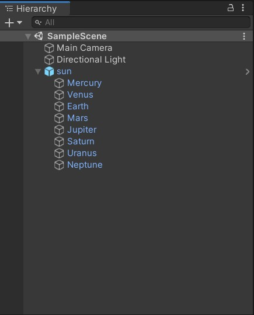
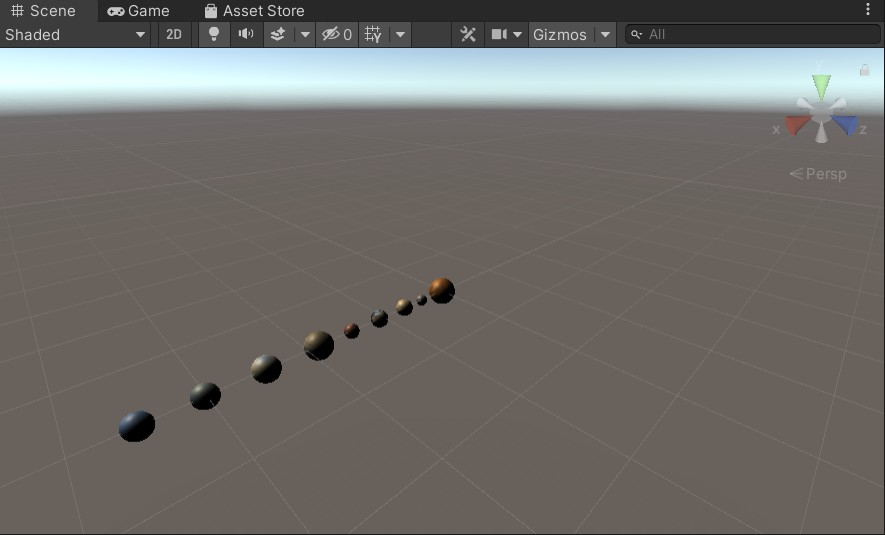
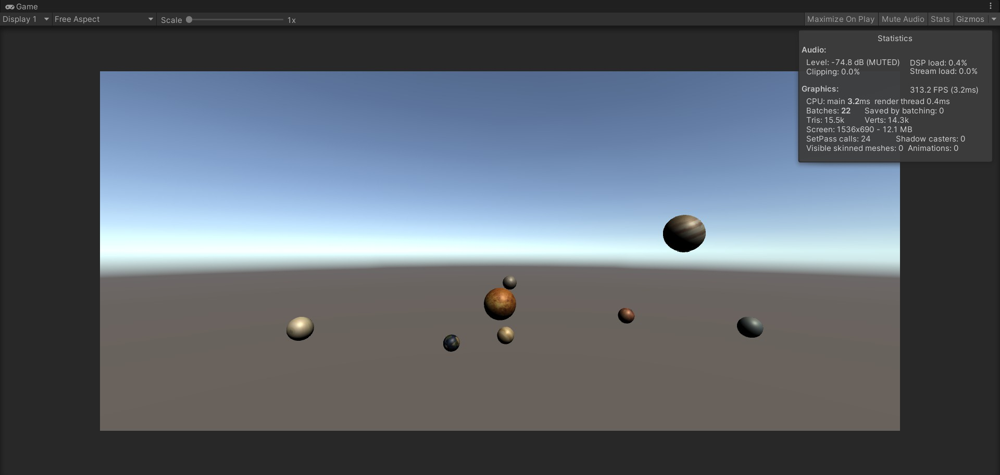
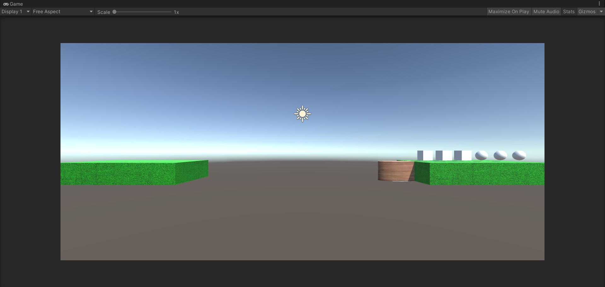
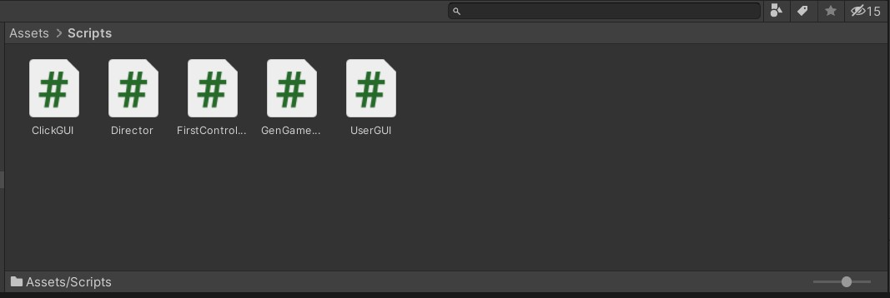
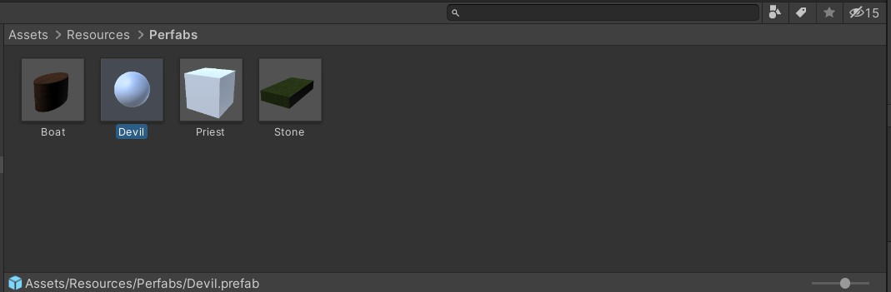
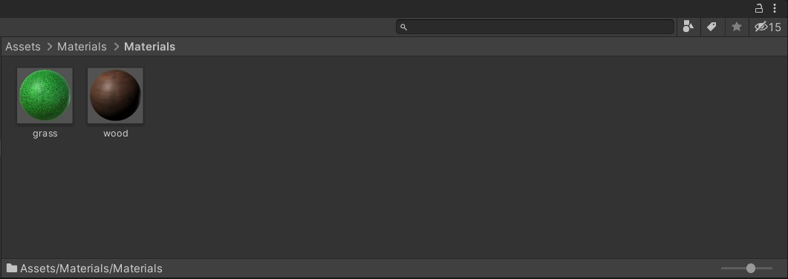

# 3D 游戏编程 ｜ 空间与运动 - 作业

## 作业内容

### 1、简答并用程序验证

* 游戏对象运动的本质是什么？
  > 游戏对象运动的本质就是游戏对象跟随每一帧的变化在空间中发生变化的过程。
  >
  > 这里的空间变化包括了游戏对象的transform组件中的position和rotation两个属性，前者是绝对或者相对位置的改变，后者是所处位置的角度的旋转变化。

* 请用三种方法以上方法，实现物体的抛物线运动。
  * 方法一 - 直接利用物体position的改变来进行操作
  
      ```c#
      using System.Collections;
      using System.Collections.Generic;
      using UnityEngine;
      
      public class test : MonoBehaviour {
          private float speed = 0.0f;
          // Start is called before the first frame update
          void Start () {
      
          }
      
          // Update is called once per frame
          void Update () {
              transform.position += Vector3.left * 5.0f ;
              transform.position += Vector3.down * speed * Time.deltaTime;
              speed += 9.8f * Time.deltaTime;
          }
      }
      ```
  
  * 方法二 - 将物体的改变用一个新的Vector3向量来表示，将其和物体原本向量叠加：
  
      ```c#
      using System.Collections;
      using System.Collections.Generic;
      using UnityEngine;
      
      public class test : MonoBehaviour {
          private float speed = 0.0f;
          // Start is called before the first frame update
          void Start () {
      
          }
      
          // Update is called once per frame
          void Update () {
              transform.position += new Vector3(Time.deltaTime * 5.0f, Time.deltaTime * speed, 0);
              speed -= Time.deltaTime * 9.8f;
          }
      }
      
      ```
  
  * 方法三 - 调用transform中的translate函数来改变position，同样也会利用到Vector3向量：
  
      ```c#
      using System.Collections;
      using System.Collections.Generic;
      using UnityEngine;
      
      public class test : MonoBehaviour {
          private float speed = 0.0f;
          // Start is called before the first frame update
          void Start () {
      
          }
      
          // Update is called once per frame
          void Update () {
              transform.Translate(new Vector3(Time.deltaTime * 5.0f, Time.deltaTime * speed, 0));
              speed -= Time.deltaTime * 9.8f;
          }
      }
      ```
  
      
  
* 写一个程序，实现一个完整的太阳系， 其他星球围绕太阳的转速必须不一样，且不在一个法平面上。

  * 收集图片和相关资料

    * 收集八大行星和太阳的表面贴图

    * 查询各个行星球体半径和公转轨道信息

      实践后发现，如果按照真实比例来进行实验，太阳的半径远远大于其他球体，这使得其他行星在运行时几乎看不见，所以只能使用相对的半径大小。

      本实验设太阳半径为单位长度1，则其他行星的相对半径为：水 - 0.4，金 - 0.6，地 - 0.6，火 - 0.5，木 - 0.9，土 - 0.8，天 - 0.7，海 - 0.7

  * 制作预制

    太阳系对象组织的结构

    

    按照查询的半径，调整各个行星的位置

    

  * 编写脚本程序
  
    ```c#
    using System.Collections;
    using System.Collections.Generic;
    using UnityEngine;
    
    public class SolarSystem : MonoBehaviour {
        void Start () {
            
        }
    	// 自转
        void Rotation () {
            GameObject.Find("Mercury").transform.Rotate(Vector3.up * Time.deltaTime * 365);
            GameObject.Find("Venus").transform.Rotate(Vector3.up * Time.deltaTime * 400);
            GameObject.Find("Earth").transform.Rotate(Vector3.up * Time.deltaTime * 300);
            GameObject.Find("Mars").transform.Rotate(Vector3.up * Time.deltaTime * 250);
            GameObject.Find("Jupiter").transform.Rotate(Vector3.up * Time.deltaTime * 200);
            GameObject.Find("Saturn").transform.Rotate(Vector3.up * Time.deltaTime * 190);
            GameObject.Find("Uranus").transform.Rotate(Vector3.up * Time.deltaTime * 180);
            GameObject.Find("Neptune").transform.Rotate(Vector3.up * Time.deltaTime * 160);
        }
        
        // 公转
        void Orbital () {
            GameObject.Find("Mercury").transform.RotateAround(Vector3.zero, new Vector3(0, 10, 10), 25 * Time.deltaTime);
            GameObject.Find("Venus").transform.RotateAround(Vector3.zero, new Vector3(0, 20, 20), 20 * Time.deltaTime);
            GameObject.Find("Earth").transform.RotateAround(Vector3.zero, new Vector3(0, 30, 30), 30 * Time.deltaTime);
            GameObject.Find("Mars").transform.RotateAround(Vector3.zero, new Vector3(0, 40, 40), 45 * Time.deltaTime);
            GameObject.Find("Jupiter").transform.RotateAround(Vector3.zero, new Vector3(0, 50, 50), 35 * Time.deltaTime);
            GameObject.Find("Saturn").transform.RotateAround(Vector3.zero, new Vector3(0, 60, 60), 40 * Time.deltaTime);
            GameObject.Find("Uranus").transform.RotateAround(Vector3.zero, new Vector3(0, 70, 70), 45 * Time.deltaTime);
            GameObject.Find("Neptune").transform.RotateAround(Vector3.zero, new Vector3(0, 90, 90), 50 * Time.deltaTime);
        }
    
        void Update () {
            Rotation();
            Orbital();
      }
    }
    ```
    
  * 运行游戏
  
    
  
  * [资源代码传送门](./solar-system-src/)


### 2、编程实践

- 阅读以下游戏脚本

> Priests and Devils
>
> Priests and Devils is a puzzle game in which you will help the Priests and Devils to cross the river within the time limit. There are 3 priests and 3 devils at one side of the river. They all want to get to the other side of this river, but there is only one boat and this boat can only carry two persons each time. And there must be one person steering the boat from one side to the other side. In the flash game, you can click on them to move them and click the go button to move the boat to the other direction. If the priests are out numbered by the devils on either side of the river, they get killed and the game is over. You can try it in many > ways. Keep all priests alive! Good luck!

程序需要满足的要求：

- play the game ( http://www.flash-game.net/game/2535/priests-and-devils.html )
- 列出游戏中提及的事物（Objects）
- 用表格列出玩家动作表（规则表），注意，动作越少越好
- 请将游戏中对象做成预制
- 在场景控制器 `LoadResources` 方法中加载并初始化 长方形、正方形、球 及其色彩代表游戏中的对象。
- 使用 C# 集合类型 有效组织对象
- 整个游戏仅 主摄像机 和 一个 Empty 对象， **其他对象必须代码动态生成！！！** 。 整个游戏不许出现 Find 游戏对象， SendMessage 这类突破程序结构的 通讯耦合 语句。 **违背本条准则，不给分**
- 请使用课件架构图编程，**不接受非 MVC 结构程序**
- 注意细节，例如：船未靠岸，牧师与魔鬼上下船运动中，均不能接受用户事件！

#### 项目设计

* 理解

    > 游戏的目标是将3个牧师和3个魔鬼从河的一端安全地送到河的另一端。船最多可以载2名游戏角色。船上有游戏角色时，你才可以点击这个船，让船移动到对岸。当有一侧岸的魔鬼数多余牧师数时（包括船上的魔鬼和牧师），魔鬼就会失去控制，吃掉牧师（如果这一侧没有牧师则不会失败），游戏失败。当所有游戏角色都上到对岸时，游戏胜利。

* 游戏中提及的事物

    > - 3个牧师
    > - 3个恶魔
    > - 2个河岸
    > - 1个船
    > - 1条河

* 玩家动作表

    > - 每次开船时，船上至少有一个牧师或者一个恶魔；
    > - 当玩家点击岸上的牧师或者恶魔时，这个牧师或恶魔应该跳上船；
    > - 当某一个岸边的魔鬼数大于了牧师数量时，游戏失败；
    > - 当 3 个牧师与 3 个魔鬼均到达河的另一岸时，游戏成功；
    > - 当玩家点击重置按钮时，全部游戏对象回到最初的位置。

| 玩家动作               | 条件                                     |
| ---------------------- | ---------------------------------------- |
| 船从起始处向终点处开船 | 船在起始处，船上至少有一个牧师或一个恶魔 |
| 船从终点处向起始处开船 | 船在终点处，船上至少有一个牧师或一个恶魔 |
| 恶魔在起始处上船       | 起始处有恶魔，船上有一个空位             |
| 牧师在起始处上船       | 起始处有牧师，船上有一个空位             |
| 船的左侧空位下船       | 船的左侧位上有牧师或恶魔                 |
| 船的右侧空位下船       | 船的右侧位上有牧师或恶魔                 |

* 游戏界面的设计。先把 GameObject 通过实例确定位置、大小。此处的河岸是用 Cube 生成的;船是由 Cylinder 加上贴图生成的。

    

* MVC 框架设计

    > MVC 是界面人机交互程序设计的一种架构模式。它把程序分为三个部分：
    >
    > * 模型（Model）：数据对象及关系，游戏对象、空间关系
    > * 控制器（Controller）：接受用户事件，控制模型的变化，一个场景一个主控制器，至少实现与玩家交互的接口（ IPlayerAction，实现或管理运动
    > * 界面（View）：显示模型，将人机交互事件交给控制器处理，处收 Input 事件，渲染 GUI ，接收事件。
    * 场景中的所有 GameObject 就是 Model，它们受到 Controller 的控制，比如说牧师和魔鬼受到 MyCharacterController 类的控制，船受到 BoatController 类的控制，河岸受到CoastController 类的控制。

    * View 就是 UserGUI 和 ClickGUI，它们展示游戏结果，并提供用户交互的渠道（点击物体和按钮）。

    * Controller：除了刚才说的 MyCharacterController、BoatController、CoastController以外，还有更高一层的Controller（场景控制器），FirstController 控制着这个场景中的所有对象，包括其加载、通信、用户输入。

    * Director 类是最高层的 Controller，一个游戏中只能有一个实例，它控制着场景的创建、切换、销毁、游戏暂停、游戏退出等等最高层次的功能。

    * MVC 模式的要求，游戏的架构如下模式：

        | 模块          | 功能                                       |
        | ------------- | ------------------------------------------ |
        | GenGameObject | 生成游戏中各个对象；判定游戏输赢           |
        | Director      | 控制游戏中各个对象的基类以及各种相应的事件 |
        | ClickGUI      | 检测用户操作，调用各个对象的方法           |
        | UserGUI       | 向用户提供提示信息                         |

        

* 编写代码

    * Director

        利用单例模式创建导演，一个游戏只能有一个导演，这里继承于 System.Object，保持导演类一直存在，不被 Unity 内存管理而管理，导演类似于生活中的导演，安排场景，场景切换，都是靠它来指挥。

        ```c#
        public class Director : System.Object {
            private static Director _instance;
            public SceneController currentSceneController { get; set; }
        
            public static Director getInstance() {
                if (_instance == null) {
                    _instance = new Director ();
                }
                return _instance;
            }
        }
        ```

    * UserGUI

        建立用户的交互界面，加载一些对用户的提示信息，比如按钮和标签

        ```c#
        public class UserGUI : MonoBehaviour {
        	private UserAction action;
        	public int status = 0;
        	GUIStyle style;
        	GUIStyle buttonStyle;
        
        	void Start() {
        		action = Director.getInstance ().currentSceneController as UserAction;
        
        		style = new GUIStyle();
        		style.fontSize = 40;
        		style.alignment = TextAnchor.MiddleCenter;
        
        		buttonStyle = new GUIStyle("button");
        		buttonStyle.fontSize = 30;
        	}
        	void OnGUI() {
        		if (status == 1) {
        			GUI.Label(new Rect(Screen.width/2-50, Screen.height/2-85, 100, 50), "Gameover!", style);
        			if (GUI.Button(new Rect(Screen.width/2-70, Screen.height/2, 140, 70), "Restart", buttonStyle)) {
        				status = 0;
        				action.restart ();
        			}
        		} else if(status == 2) {
        			GUI.Label(new Rect(Screen.width/2-50, Screen.height/2-85, 100, 50), "You win!", style);
        			if (GUI.Button(new Rect(Screen.width/2-70, Screen.height/2, 140, 70), "Restart", buttonStyle)) {
        				status = 0;
        				action.restart ();
        			}
        		}
        	}
        }
        ```

    * ClickGUI

        检测船和角色是否被点击
        点击则触发接口中的动作。然后进入控制器进行对应的函数操作，通过接口，完成对事件的响应。

        ```c#
        public class ClickGUI : MonoBehaviour {
        	UserAction action;
        	MyCharacterController characterController;
        
        	public void setController(MyCharacterController characterCtrl) {
        		characterController = characterCtrl;
        	}
        
        	void Start() {
        		action = Director.getInstance ().currentSceneController as UserAction;
        	}
        
        	void OnMouseDown() {
        		if (gameObject.name == "boat") {
        			action.moveBoat ();
        		} else {
        			action.characterIsClicked (characterController);
        		}
        	}
        }
        ```

    * Moveable

        让角色水平移动再垂直移动或是先垂直移动再实现角色水平移动，通过每一帧检测是否移动。

        对于船的移动，我们需要注意的是：判定船上是否有至少一个牧师或恶魔，船是从哪一边的河岸出发，向哪一边的河岸开动。此处定义了一个 int 型变量 moving_status

        ```c#
        public class Moveable: MonoBehaviour {
            
            readonly float move_speed = 20;
        
            // change frequently
            int moving_status;  // 0->not moving, 1->moving to middle, 2->moving to dest
            Vector3 dest;
            Vector3 middle;
        
            void Update() {
                if (moving_status == 1) {
                    transform.position = Vector3.MoveTowards (transform.position, middle, move_speed * Time.deltaTime);
                    if (transform.position == middle) {
                        moving_status = 2;
                    }
                } else if (moving_status == 2) {
                    transform.position = Vector3.MoveTowards (transform.position, dest, move_speed * Time.deltaTime);
                    if (transform.position == dest) {
                        moving_status = 0;
                    }
                }
            }
            public void setDestination(Vector3 _dest) {
                dest = _dest;
                middle = _dest;
                if (_dest.y == transform.position.y) {  // boat moving
                    moving_status = 2;
                }
                else if (_dest.y < transform.position.y) {  // character from coast to boat
                    middle.y = transform.position.y;
                } else {                                // character from boat to coast
                    middle.x = transform.position.x;
                }
                moving_status = 1;
            }
        
            public void reset() {
                moving_status = 0;
            }
        }
        ```

    * CoastController

        对河岸的状态进行控制，判断岸上有多少牧师与恶魔
        陆地的属性：陆地有两块，一个标志位来记录是开始的陆地还是结束陆地，陆地的位置，以及陆地上的角色，每个角色的位置

        ```c#
        public class CoastController {
            readonly GameObject coast;
            readonly Vector3 from_pos = new Vector3(8.5f,0,0);
            readonly Vector3 to_pos = new Vector3(-8.5f,0,0);
            readonly Vector3[] positions;
            readonly int to_or_from;    // to->-1, from->1
            // change frequently
            MyCharacterController[] passengerPlaner;
        
            public CoastController(string _to_or_from) {
                positions = new Vector3[] {new Vector3(6.5F,0.8f,0), new Vector3(7.5F,0.8F,0), new Vector3(8.5F,0.8F,0), 
                    new Vector3(9.5F,0.8F,0), new Vector3(10.5F,0.8F,0), new Vector3(11.5F,0.8F,0)};
        
                passengerPlaner = new MyCharacterController[6];
        
                if (_to_or_from == "from") {
                    coast = Object.Instantiate (Resources.Load ("Perfabs/Stone", typeof(GameObject)), from_pos, Quaternion.identity, null) as GameObject;
                    coast.name = "from";
                    to_or_from = 1;
                } else {
                    coast = Object.Instantiate (Resources.Load ("Perfabs/Stone", typeof(GameObject)), to_pos, Quaternion.identity, null) as GameObject;
                    coast.name = "to";
                    to_or_from = -1;
                }
            }
        
            public int getEmptyIndex() {
                for (int i = 0; i < passengerPlaner.Length; i++) {
                    if (passengerPlaner [i] == null) {
                        return i;
                    }
                }
                return -1;
            }
        
            public Vector3 getEmptyPosition() {
                Vector3 pos = positions [getEmptyIndex ()];
                pos.x *= to_or_from;
                return pos;
            }
        
            public void getOnCoast(MyCharacterController characterCtrl) {
                int index = getEmptyIndex ();
                passengerPlaner [index] = characterCtrl;
            }
        
            public MyCharacterController getOffCoast(string passenger_name) {   // 0->priest, 1->devil
                for (int i = 0; i < passengerPlaner.Length; i++) {
                    if (passengerPlaner [i] != null && passengerPlaner [i].getName () == passenger_name) {
                        MyCharacterController charactorCtrl = passengerPlaner [i];
                        passengerPlaner [i] = null;
                        return charactorCtrl;
                    }
                }
                Debug.Log ("cant find passenger on coast: " + passenger_name);
                return null;
            }
        
            public int get_to_or_from() {
                return to_or_from;
            }
        
            public int[] getCharacterNum() {
                int[] count = {0, 0};
                for (int i = 0; i < passengerPlaner.Length; i++) {
                    if (passengerPlaner [i] == null)
                        continue;
                    if (passengerPlaner [i].getType () == 0) {  // 0->priest, 1->devil
                        count[0]++;
                    } else {
                        count[1]++;
                    }
                }
                return count;
            }
        
            public void reset() {
                passengerPlaner = new MyCharacterController[6];
            }
        }
        ```

    * Character

        对牧师与恶魔控制的一个类，完成牧师与恶魔上船、下船、随船一起过等事件时单独游戏对象位置的变化

        用于控制 6 个角色的动作，比如上船，上岸等。
        一个角色的属性：标志角色是牧师还是恶魔，标志是否在船上
        角色模型的函数：去到陆地/船上(其实就是把哪个作为父节点，并且修改是否在船上标志)，其他就是基本的 get/set 函数。

        ```c#
        public class MyCharacterController {
            readonly GameObject character;
            readonly Moveable moveableScript;
            readonly ClickGUI clickGUI;
            readonly int characterType; // 0->priest, 1->devil
        
            // change frequently
            bool _isOnBoat;
            CoastController coastController;
        
        
            public MyCharacterController(string which_character) {
        
                if (which_character == "priest") {
                    character = Object.Instantiate (Resources.Load ("Perfabs/Priest", typeof(GameObject)), Vector3.zero, Quaternion.identity, null) as GameObject;
                    characterType = 0;
                } else {
                    character = Object.Instantiate (Resources.Load ("Perfabs/Devil", typeof(GameObject)), Vector3.zero, Quaternion.identity, null) as GameObject;
                    characterType = 1;
                }
                moveableScript = character.AddComponent (typeof(Moveable)) as Moveable;
        
                clickGUI = character.AddComponent (typeof(ClickGUI)) as ClickGUI;
                clickGUI.setController (this);
            }
        
            public void setName(string name) {
                character.name = name;
            }
        
            public void setPosition(Vector3 pos) {
                character.transform.position = pos;
            }
        
            public void moveToPosition(Vector3 destination) {
                moveableScript.setDestination(destination);
            }
        
            public int getType() {  // 0->priest, 1->devil
                return characterType;
            }
        
            public string getName() {
                return character.name;
            }
        
            public void getOnBoat(BoatController boatCtrl) {
                coastController = null;
                character.transform.parent = boatCtrl.getGameobj().transform;
                _isOnBoat = true;
            }
        
            public void getOnCoast(CoastController coastCtrl) {
                coastController = coastCtrl;
                character.transform.parent = null;
                _isOnBoat = false;
            }
        
            public bool isOnBoat() {
                return _isOnBoat;
            }
        
            public CoastController getCoastController() {
                return coastController;
            }
        
            public void reset() {
                moveableScript.reset ();
                coastController = (Director.getInstance ().currentSceneController as FirstController).fromCoast;
                getOnCoast (coastController);
                setPosition (coastController.getEmptyPosition ());
                coastController.getOnCoast (this);
            }
        }
        ```

    * Boat

        用于控制船的运动以及角色的上下船绑定。
        船的属性：船在开始/结束陆地旁的位置，在开始/结束陆地旁船上可以载客的两个位置(用 Vector3 的数组表示)，船上载有的角色(用角色模型的数组来记录)，标记船在开始陆地还是结束陆地的旁边。

        对船的状态进行控制，判断船上有多少个牧师或者恶魔

        ```c#
        public class BoatController {
            readonly GameObject boat;
            readonly Moveable moveableScript;
            readonly Vector3 fromPosition = new Vector3 (5, 0, 0);
            readonly Vector3 toPosition = new Vector3 (-5, 0, 0);
            readonly Vector3[] from_positions;
            readonly Vector3[] to_positions;
        
            // change frequently
            int to_or_from; // to->-1; from->1
            MyCharacterController[] passenger = new MyCharacterController[2];
        
            public BoatController() {
                to_or_from = 1;
        
                from_positions = new Vector3[] { new Vector3 (4.5F, 0.8f, 0), new Vector3 (5.5F, 0.8f, 0) };
                to_positions = new Vector3[] { new Vector3 (-5.5F, 0.8f, 0), new Vector3 (-4.5F, 0.8f, 0) };
        
                boat = Object.Instantiate (Resources.Load ("Perfabs/Boat", typeof(GameObject)), fromPosition, Quaternion.identity, null) as GameObject;
                boat.name = "boat";
        
                moveableScript = boat.AddComponent (typeof(Moveable)) as Moveable;
                boat.AddComponent (typeof(ClickGUI));
            }
        
        
            public void Move() {
                if (to_or_from == -1) {
                    moveableScript.setDestination(fromPosition);
                    to_or_from = 1;
                } else {
                    moveableScript.setDestination(toPosition);
                    to_or_from = -1;
                }
            }
        
            public int getEmptyIndex() {
                for (int i = 0; i < passenger.Length; i++) {
                    if (passenger [i] == null) {
                        return i;
                    }
                }
                return -1;
            }
        
            public bool isEmpty() {
                for (int i = 0; i < passenger.Length; i++) {
                    if (passenger [i] != null) {
                        return false;
                    }
                }
                return true;
            }
        
            public Vector3 getEmptyPosition() {
                Vector3 pos;
                int emptyIndex = getEmptyIndex ();
                if (to_or_from == -1) {
                    pos = to_positions[emptyIndex];
                } else {
                    pos = from_positions[emptyIndex];
                }
                return pos;
            }
        
            public void GetOnBoat(MyCharacterController characterCtrl) {
                int index = getEmptyIndex ();
                passenger [index] = characterCtrl;
            }
        
            public MyCharacterController GetOffBoat(string passenger_name) {
                for (int i = 0; i < passenger.Length; i++) {
                    if (passenger [i] != null && passenger [i].getName () == passenger_name) {
                        MyCharacterController charactorCtrl = passenger [i];
                        passenger [i] = null;
                        return charactorCtrl;
                    }
                }
                Debug.Log ("Cant find passenger in boat: " + passenger_name);
                return null;
            }
        
            public GameObject getGameobj() {
                return boat;
            }
        
            public int get_to_or_from() { // to->-1; from->1
                return to_or_from;
            }
        
            public int[] getCharacterNum() {
                int[] count = {0, 0};
                for (int i = 0; i < passenger.Length; i++) {
                    if (passenger [i] == null)
                        continue;
                    if (passenger [i].getType () == 0) {    // 0->priest, 1->devil
                        count[0]++;
                    } else {
                        count[1]++;
                    }
                }
                return count;
            }
        
            public void reset() {
                moveableScript.reset ();
                if (to_or_from == -1) {
                    Move ();
                }
                passenger = new MyCharacterController[2];
            }
        }
        ```

    * FirstController

        控制器，对场景中的具体对象进行操作，这个控制器继承了两个接口类并实现了它们的方法，控制器是场景中各游戏对象行为改变的核心。他引用模型控制器以及接口的命名空间来调用其中实现的函数来达到控制的目的。其中重新开始函数可以调用，实现重新开始的目的，起作用就是重新加载场景。

        ```c#
        public class FirstController : MonoBehaviour, SceneController, UserAction {
        	readonly Vector3 water_pos = new Vector3(0,0,0);
        
        	UserGUI userGUI;
        
        	public CoastController fromCoast;
        	public CoastController toCoast;
        	public BoatController boat;
        	private MyCharacterController[] characters;
        
        	void Awake() {
        		Director director = Director.getInstance ();
        		director.currentSceneController = this;
        		userGUI = gameObject.AddComponent <UserGUI>() as UserGUI;
        		characters = new MyCharacterController[6];
        		loadResources ();
        	}
        
        	public void loadResources() {
        
        		fromCoast = new CoastController ("from");
        		toCoast = new CoastController ("to");
        		boat = new BoatController ();
        
        		loadCharacter ();
        	}
        
        	private void loadCharacter() {
        		for (int i = 0; i < 3; i++) {
        			MyCharacterController cha = new MyCharacterController ("priest");
        			cha.setName("priest" + i);
        			cha.setPosition (fromCoast.getEmptyPosition ());
        			cha.getOnCoast (fromCoast);
        			fromCoast.getOnCoast (cha);
        
        			characters [i] = cha;
        		}
        
        		for (int i = 0; i < 3; i++) {
        			MyCharacterController cha = new MyCharacterController ("devil");
        			cha.setName("devil" + i);
        			cha.setPosition (fromCoast.getEmptyPosition ());
        			cha.getOnCoast (fromCoast);
        			fromCoast.getOnCoast (cha);
        
        			characters [i+3] = cha;
        		}
        	}
        
        
        	public void moveBoat() {
        		if (boat.isEmpty ())
        			return;
        		boat.Move ();
        		userGUI.status = check_game_over ();
        	}
        
        	public void characterIsClicked(MyCharacterController characterCtrl) {
        		if (characterCtrl.isOnBoat ()) {
        			CoastController whichCoast;
        			if (boat.get_to_or_from () == -1) { // to->-1; from->1
        				whichCoast = toCoast;
        			} else {
        				whichCoast = fromCoast;
        			}
        
        			boat.GetOffBoat (characterCtrl.getName());
        			characterCtrl.moveToPosition (whichCoast.getEmptyPosition ());
        			characterCtrl.getOnCoast (whichCoast);
        			whichCoast.getOnCoast (characterCtrl);
        
        		} else {									// character on coast
        			CoastController whichCoast = characterCtrl.getCoastController ();
        
        			if (boat.getEmptyIndex () == -1) {		// boat is full
        				return;
        			}
        
        			if (whichCoast.get_to_or_from () != boat.get_to_or_from ())	// boat is not on the side of character
        				return;
        
        			whichCoast.getOffCoast(characterCtrl.getName());
        			characterCtrl.moveToPosition (boat.getEmptyPosition());
        			characterCtrl.getOnBoat (boat);
        			boat.GetOnBoat (characterCtrl);
        		}
        		userGUI.status = check_game_over ();
        	}
        
        	int check_game_over() {	// 0->not finish, 1->lose, 2->win
        		int from_priest = 0;
        		int from_devil = 0;
        		int to_priest = 0;
        		int to_devil = 0;
        
        		int[] fromCount = fromCoast.getCharacterNum ();
        		from_priest += fromCount[0];
        		from_devil += fromCount[1];
        
        		int[] toCount = toCoast.getCharacterNum ();
        		to_priest += toCount[0];
        		to_devil += toCount[1];
        
        		if (to_priest + to_devil == 6)		// win
        			return 2;
        
        		int[] boatCount = boat.getCharacterNum ();
        		if (boat.get_to_or_from () == -1) {	// boat at toCoast
        			to_priest += boatCount[0];
        			to_devil += boatCount[1];
        		} else {	// boat at fromCoast
        			from_priest += boatCount[0];
        			from_devil += boatCount[1];
        		}
        		if (from_priest < from_devil && from_priest > 0) {		// lose
        			return 1;
        		}
        		if (to_priest < to_devil && to_priest > 0) {
        			return 1;
        		}
        		return 0;			// not finish
        	}
        
        	public void restart() {
        		boat.reset ();
        		fromCoast.reset ();
        		toCoast.reset ();
        		for (int i = 0; i < characters.Length; i++) {
        			characters [i].reset ();
        		}
        	}
        }
        ```

    * 预设

        在场景中创建好各个对象并加入材料，然后将其摆放到正确位置。之后将游戏对象拖入 Prefabs 文件夹，在游戏中想要调用预设就使用路径「Prefabs/xxx」即可加载对应的预设。

        

        

        最后将场景控制器的脚本挂载到创建的空物体上就可以开始运行游戏。

* 运行游戏

    

* [代码传送门](./priest-and-devils-src/)


