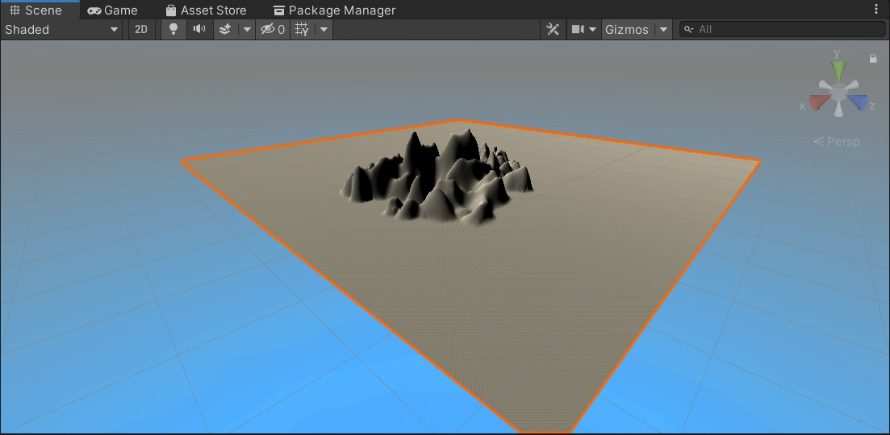
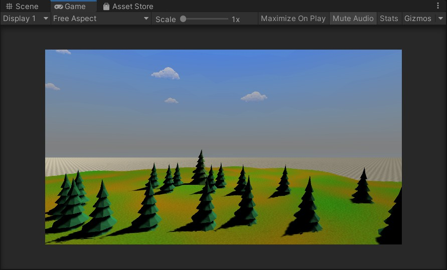
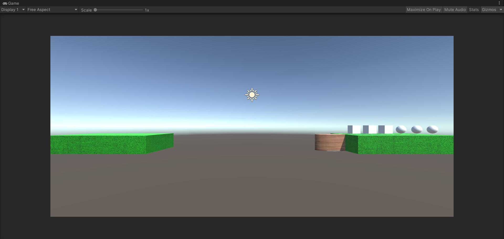
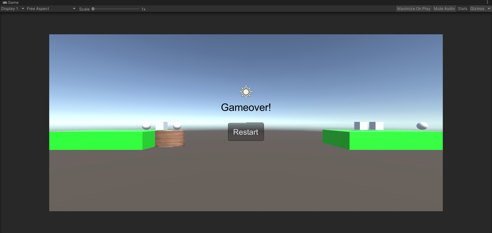

# 3D 游戏编程 ｜ 游戏对象与图形基础 - 作业

## 作业内容

### 1、基本操作演练

下载 Fantasy Skybox FREE， 构建自己的游戏场景

- 在 Asset Store 中搜索 Fantasy Skybox，并下载

    

- 把所需要的贴图放入Assert中，创建一个Material，并将Shader的值改为Skybox/6 Sided，把天空盒每个面的贴图都贴上去，创建一个Terrain，然后可在Inspector面板上对地形进行修改。

    

- 制作好地表的形状后，添加草地，树木等资源。最后，将调整摄像机调整到合适的位置，制作完成。

    


写一个简单的总结，总结游戏对象的使用

* 一个游戏对象其实只是一个容器，它只有一些基础的属性，剩下的还得自己通过添加组件来构建它。我们可以给它们添加C# script，写出各种方法来定义它的行为和属性，控制它的动作，然后我们还可以给它们添加纹理，给他们各种外观，我们还可以添加其他组件来定义它的属性、行为，达到各种效果。游戏对象是由它拥有的组件来决定它的功能的。
* 最常见的游戏对象就是角色、地形等的实例游戏对象，对这类游戏对象，常见操作有对象的移动、实例化预设加载游戏对象、挂载脚本、设置对象形状属性、添加删改组件等，这是我们游戏过程中最直接操作和接触的游戏对象。
* 更改对象的属性可以实现各种效果。通过transform的position属性可以很轻松地对对象的位置进行修改，产生移动的效果。通过对象的transform.parent可以组织对象之间的上下关系，可以比较方便地进行各种操作。


### 2、编程实践 - 牧师与魔鬼 动作分离版

#### 要求

设计一个裁判类，当游戏达到结束条件时，通知场景控制器游戏结束

#### 设计

* UML 图

    

- 裁判 - JudgeController

    裁判类将原来FirstController中的check函数抽离出来，专门做游戏状态的检测，在游戏结束时通过回调通知FirstController场记
    
    ```c#
    public class JudgeController : MonoBehaviour
    {
        public FirstController mainController;
        public Shore leftShoreModel;
        public Shore rightShoreModel;
        public Boat boatModel;
        // Start is called before the first frame update
        void Start()
        {
            mainController = (FirstController)SSDirector.GetInstance().CurrentSceneController;
            this.leftShoreModel = mainController.leftShoreController.GetShore();
            this.rightShoreModel = mainController.rightShoreController.GetShore();
            this.boatModel = mainController.boatController.GetBoatModel();
        }
    
        // Update is called once per frame
        void Update()
        {
            if (!mainController.isRunning)
                return;
            if (mainController.time <= 0)
            {
                mainController.JudgeCallback(false, "Game Over!");
                return;
            }
            this.gameObject.GetComponent<UserGUI>().gameMessage = "";
            //判断是否已经胜利
            if (rightShoreModel.priestCount == 3)
            {
                mainController.JudgeCallback(false, "You Win!");
                return;
            }
            else
            {
                
                int leftPriestNum, leftDevilNum, rightPriestNum, rightDevilNum;
                leftPriestNum = leftShoreModel.priestCount + (boatModel.isRight ? 0 : boatModel.priestCount);
                leftDevilNum = leftShoreModel.devilCount + (boatModel.isRight ? 0 : boatModel.devilCount);
                if (leftPriestNum != 0 && leftPriestNum < leftDevilNum)
                {
                    mainController.JudgeCallback(false, "Game Over!");
                    return;
                }
                rightPriestNum = rightShoreModel.priestCount + (boatModel.isRight ? boatModel.priestCount : 0);
                rightDevilNum = rightShoreModel.devilCount + (boatModel.isRight ? boatModel.devilCount : 0);
                if (rightPriestNum != 0 && rightPriestNum < rightDevilNum)
                {
                    mainController.JudgeCallback(false, "Game Over!");
                    return;
                }
            }
        }
    }
    
    ```
    
- 动作基类 - SSAction

    创建了动作的基本元素，继承ScriptableObject类，不需要绑定具体的游戏对象，参考了老师给出的SSAction。代码如下
    
    ```c#
    public class SSAction : ScriptableObject
    {
        public bool enable = true;
        public bool destroy = false;
    
        public GameObject gameobject { get; set; }
        public Transform transform { get; set; }
        public ISSActionCallback callback { get; set; }
    
        protected SSAction() { }
    
        public virtual void Start()
        {
            throw new System.NotImplementedException();
        }
    
        public virtual void Update()
        {
            throw new System.NotImplementedException();
        }
    }
    ```
    
- 动作事件基本类型 - SSActionEventType

    SSActionEventType 是一个枚举型，ISSActionCallback 是一个接口，其中定义了函数SSActionEvent。代码如下

    ```c#
    public enum SSActionEventType : int { Started, Competeted }
    
    public interface ISSActionCallback
    {
        void SSActionEvent(SSAction source, SSActionEventType events = SSActionEventType.Competeted,
            int intParam = 0, string strParam = null, Object objectParam = null);
    }
    ```


* 动作管理基类 - SSActionManager

    在 Action 队列中有等待处理的事件，以及处理完毕之后等待删除的事件。RunAction 函数接收GameObject、SSAction 的实例和 ISSActionCallback 的回调接口，将等待处理的游戏对象加入到队列中，用SSAction来处理事件。AddAction 可以将游戏对象和动作绑定，并实现动作的自动回收。代码如下
    
    ```c#
    public class SSActionManager : MonoBehaviour
    {
        private Dictionary<int, SSAction> actions = new Dictionary<int, SSAction>();
        private List<SSAction> waitingAdd = new List<SSAction>();
        private List<int> waitingDelete = new List<int>();
    
        // Use this for initialization
        void Start()
        {
    
        }
    
        // Update is called once per frame
        protected void Update()
        {
            foreach (SSAction ac in waitingAdd)
                actions[ac.GetInstanceID()] = ac;
            waitingAdd.Clear();
    
            foreach (KeyValuePair<int, SSAction> kv in actions)
            {
                SSAction ac = kv.Value;
                if (ac.destroy)
                {
                    waitingDelete.Add(ac.GetInstanceID());
                }
                else if (ac.enable)
                {
                    ac.Update();
                }
            }
    
            foreach (int key in waitingDelete)
            {
                SSAction ac = actions[key]; actions.Remove(key); DestroyObject(ac);
            }
            waitingDelete.Clear();
        }
    
        public void RunAction(GameObject gameobject, SSAction action, ISSActionCallback manager)
        {
            action.gameobject = gameobject;
            action.transform = gameobject.transform;
            action.callback = manager;
            waitingAdd.Add(action);
            action.Start();
        }
    }
    ```
    

* 游戏事件控制 CCActionManager

    CCActionManager是对具体游戏事件的控制，其中包含三个方法：Start()，Update()，和SSActionEvent()。Start() 方法中用于将 SSDirector 实例化，Update() 方法中用于实现具体的游戏事件，SSActionEvent() 方法则是接口 ISSActionCallback 中的。 之后的具体动作将继承 SSActionManager 并作为类中的一个对象从而管理动作。代码如下

    ```c#
    public class CCActionManager : SSActionManager, ISSActionCallback
    {
        public GenGameObject sceneController;
        public CCGetOnTheBoat getonA;
        public CCGetOffBoat getoffB;
        public CCBoatMoving boatmovingC;
    
        // Use this for initialization
        protected void Start()
        {
            sceneController = (GenGameObject)SSDirector.getInstance().currentScenceController;
            sceneController.actionManager = this;
        }
    
        // Update is called once per frame
        protected new void Update()
        {
            if (Input.GetMouseButtonDown(0) && sceneController.game == 0)
            {
                Ray ray = Camera.main.ScreenPointToRay(Input.mousePosition);
                RaycastHit hit;
                if (Physics.Raycast(ray, out hit))
                {
                    if (hit.transform.tag == "Devil" || hit.transform.tag == "Priest")
                    {
                        if (hit.collider.gameObject == sceneController.boat[0] || hit.collider.gameObject == sceneController.boat[1])
                        {
                            if (hit.collider.gameObject == sceneController.boat[0])
                            {
                                getoffB = CCGetOffBoat.GetSSAction(0);
                                this.RunAction(hit.collider.gameObject, getoffB, this);
                            }
                            else
                            {
                                getoffB = CCGetOffBoat.GetSSAction(1);
                                this.RunAction(hit.collider.gameObject, getoffB, this);
                            }
                        }
                        else
                        {
                            getonA = CCGetOnTheBoat.GetSSAction();
                            this.RunAction(hit.collider.gameObject, getonA, this);
                        }
                    }
                    else if (hit.transform.tag == "Boat" && sceneController.boatCapacity != 2)
                    {
                        print(hit.transform.tag);
                        boatmovingC = CCBoatMoving.GetSSAction();
                        this.RunAction(hit.collider.gameObject, boatmovingC, this);
                    }
                }
            }
            base.Update();
        }
    
        public void SSActionEvent(SSAction source, SSActionEventType events = SSActionEventType.Competeted,
            int intParam = 0, string strParam = null, Object objectParam = null)
        {
            //
        }
    }
    ```

    

    下面三个具体的类全都继承 SSAction 类，也同时在 Start() 函数中实例化了 SSDirector，在Update 中各自实现自身的个性化。

* 船移动游戏事件控制 - CCBoatMoving

    船移动的具体方法，继承SSAction，将GenGameObject作为其中一个对象。代码如下
    
    ```c#
    public class CCBoatMoving : SSAction
    {
       public GenGameObject sceneController;
    
       public static CCBoatMoving GetSSAction()
       {
           CCBoatMoving action = ScriptableObject.CreateInstance<CCBoatMoving>();
           return action;
       }
       // Use this for initialization
       public override void Start()
       {
           sceneController = (GenGameObject)SSDirector.getInstance().currentScenceController;
       }
    
       // Update is called once per frame
       public override void Update()
       {
           if (sceneController.boat_position == 1)
           {
               sceneController.boat_position = 0;
               while (this.transform.position != sceneController.boatStartPos)
                   this.transform.position = Vector3.MoveTowards(this.transform.position, sceneController.boatStartPos, 1);
           }
           else if (sceneController.boat_position == 0)
           {
               sceneController.boat_position = 1;
               while (this.transform.position != sceneController.boatEndPos)
                   this.transform.position = Vector3.MoveTowards(this.transform.position, sceneController.boatEndPos, 1);
           }
           sceneController.check();
           this.destroy = true;
           this.callback.SSActionEvent(this);
       }
    }
    ```
    

* 下船游戏事件控制 - CCGetOffBoat

    牧师或魔鬼对象下船的具体方法，继承SSAction。代码如下
    
    ```c#
    public class CCGetOffBoat : SSAction
    {
        public int side;
        public GenGameObject sceneController;
        public static CCGetOffBoat GetSSAction(int side)
        {
            CCGetOffBoat action = ScriptableObject.CreateInstance<CCGetOffBoat>();
            action.side = side;
            return action;
        }
        // Use this for initialization
        public override void Start()
        {
            sceneController = (GenGameObject)SSDirector.getInstance().currentScenceController;
        }
    
        // Update is called once per frame
        public override void Update()
        {
            if (sceneController.boat[side] != null)
            {
                sceneController.boat[side].transform.parent = null;
                if (sceneController.boat_position == 1)
                {
    
                    if (sceneController.boat[side].transform.tag == "Priest")
                    {
                        for (int i = 0; i < 3; i++)
                        {
                            if (sceneController.priests_end[i] == null)
                            {
                                sceneController.priests_end[i] = sceneController.boat[side];
                                sceneController.boatCapacity++;
                                break;
                            }
                        }
                    }
                    else if (sceneController.boat[side].transform.tag == "Devil")
                    {
                        for (int i = 0; i < 3; i++)
                        {
                            if (sceneController.devils_end[i] == null)
                            {
                                sceneController.devils_end[i] = sceneController.boat[side];
                                sceneController.boatCapacity++;
                                break;
                            }
                        }
                    }
                }
                else if (sceneController.boat_position == 0)
                {
                    if (sceneController.boat[side].transform.tag == "Priest")
                    {
                        for (int i = 0; i < 3; i++)
                        {
                            if (sceneController.priests_start[i] == null)
                            {
                                sceneController.priests_start[i] = sceneController.boat[side];
                                sceneController.boatCapacity++;
                                break;
                            }
                        }
                    }
                    else if (sceneController.boat[side].transform.tag == "Devil")
                    {
                        for (int i = 0; i < 3; i++)
                        {
                            if (sceneController.devils_start[i] == null)
                            {
                                sceneController.devils_start[i] = sceneController.boat[side];
                                sceneController.boatCapacity++;
                                break;
                            }
                        }
                    }
                }
                sceneController.boat[side] = null;
            }
            sceneController.check();
            this.destroy = true;
            this.callback.SSActionEvent(this);
        }
    }
    ```
    
* 上船游戏事件控制 - CCGetOnTheBoat

    牧师或魔鬼对象上船的具体方法，继承SSAction，其中的对象有GameObject型接收具体作用的游戏对象。代码如下
    
    ```c#
    public class CCGetOnTheBoat : SSAction
    {
        public GenGameObject sceneController;
    
        public static CCGetOnTheBoat GetSSAction()
        {
            CCGetOnTheBoat action = ScriptableObject.CreateInstance<CCGetOnTheBoat>();
            return action;
        }
        // Use this for initialization
        public override void Start()
        {
            sceneController = (GenGameObject)SSDirector.getInstance().currentScenceController;
        }
    
        // Update is called once per frame
        public override void Update()
        {
            if (sceneController.boatCapacity != 0)
            {
                if (sceneController.boat_position == 0)
                {
                    for (int i = 0; i < 3; i++)
                    {
                        if (sceneController.devils_start[i] == gameobject)
                        {
                            sceneController.devils_start[i] = null;
                            sceneController.find = 1;
                        }
                        if (sceneController.priests_start[i] == gameobject)
                        {
                            sceneController.priests_start[i] = null;
                            sceneController.find = 1;
                        }
                    }
                }
                else if (sceneController.boat_position == 1)
                {
                    for (int i = 0; i < 3; i++)
                    {
                        if (sceneController.devils_end[i] == gameobject)
                        {
                            sceneController.devils_end[i] = null;
                            sceneController.find = 1;
                        }
                        if (sceneController.priests_end[i] == gameobject)
                        {
                            sceneController.priests_end[i] = null;
                            sceneController.find = 1;
                        }
                    }
                }
    
                if (sceneController.find == 1)
                    gameobject.transform.parent = sceneController.boat_obj.transform;
    
                if (sceneController.boat[0] == null && sceneController.find == 1)
                {
                    sceneController.boat[0] = gameobject;
                    sceneController.boat[0].transform.tag = gameobject.transform.tag;
                    sceneController.boatCapacity--;
                    this.transform.localPosition = new Vector3(0, 1.2f, 0.19f);
                }
                else if (sceneController.boat[1] == null && sceneController.find == 1)
                {
                    sceneController.boat[1] = gameobject;
                    sceneController.boat[1].transform.tag = gameobject.transform.tag;
                    sceneController.boatCapacity--;
                    this.transform.localPosition = new Vector3(0, 1.2f, -0.12f);
                }
            }
            sceneController.find = 0;
            this.destroy = true;
            this.callback.SSActionEvent(this);
        }
    }
    ```

* 点击事件脚本、用户GUI脚本和加载资源与普通版本的恶魔与牧师相同。

* 运行游戏

    

    

* [代码传送门](./priest-and-devils-v2-src/)


