# 3D 游戏编程 ｜ 与游戏世界交互 - 作业

## 作业内容

编写一个简单的鼠标打飞碟（Hit UFO）游戏

- 游戏内容要求：
    1. 游戏有 n 个 round，每个 round 都包括10 次 trial；
    2. 每个 trial 的飞碟的色彩、大小、发射位置、速度、角度、同时出现的个数都可能不同。它们由该 round 的 ruler 控制；
    3. 每个 trial 的飞碟有随机性，总体难度随 round 上升；
    4. 鼠标点中得分，得分规则按色彩、大小、速度不同计算，规则可自由设定。
- 游戏的要求：
    - 使用带缓存的工厂模式管理不同飞碟的生产与回收，该工厂必须是场景单实例的！具体实现见参考资源 Singleton 模板类
    - 近可能使用前面 MVC 结构实现人机交互与游戏模型分离

### 设计游戏

#### 布置游戏场景

* 在 Package Manager 中下载喜欢的场景

    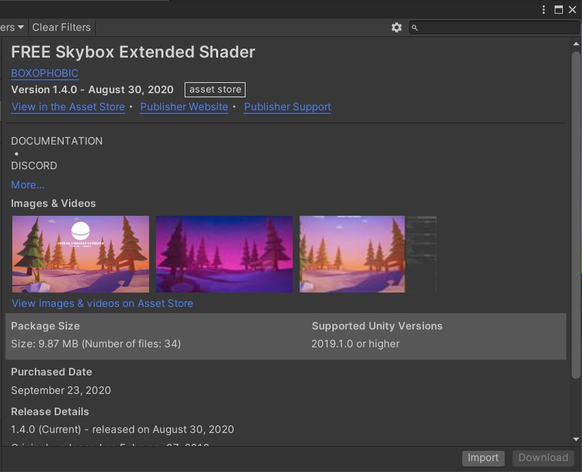

* 为 Main Camera 添加 Skybox，在其中加载下载的场景

    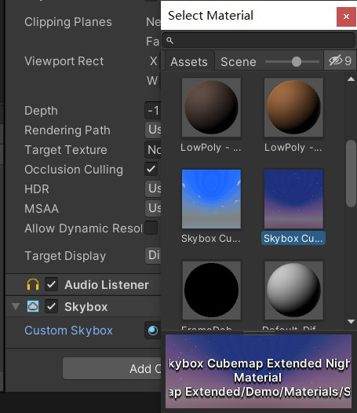

* 运行测试自己的天空盒效果

    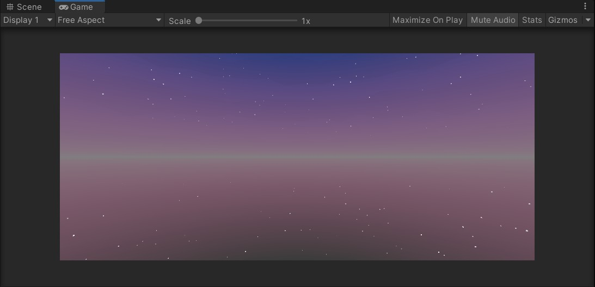

#### 设计飞碟预设

* 创建胶囊体，调整其到合适的大小，并将其保存成预设

    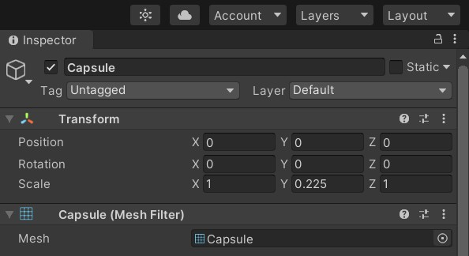

* 复制预设，创建出不同的飞碟预设

    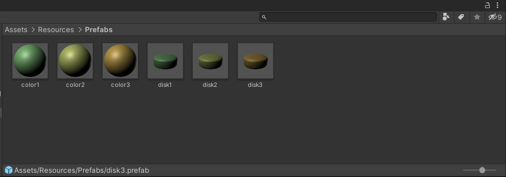

#### 编写代码

* DiskData

    定义飞碟的特征和运动属性运动

    ```c#
    public class DiskData : MonoBehaviour
    {
        public int score = 1;                               //射击此飞碟得分
        public Color color = Color.white;                   //飞碟颜色
        public Vector3 direction;                           //飞碟初始的位置
        public Vector3 scale = new Vector3( 1 ,0.25f, 1);   //飞碟大小
    }
    ```

* DiskFactory

    该类定义了如何产生和回收一个飞碟。利用 List 结构来存储飞碟。用随机数使得每个飞碟的颜色、位置、角度等都有所不同。

    工厂获取飞碟时首先应该判断工厂中是否有存在的未利用的飞碟，如果有则直接获取飞碟利用，其次才是生产新的飞碟。当飞碟在游戏场景中不需要时，不销毁它，而是通过飞碟灭活等手段移到玩家看不到的地方。这些飞碟会被工厂保存再等待队列中，直到下一次获取飞碟请求时，再拿出来利用。工厂使用两个队列来分别保存正在使用的飞碟和等待使用的飞碟。被获取后的飞碟加入正在使用的队列，回收的飞碟加入自由客再利用的队列。

    飞碟将从屏幕的左边或右边飞出，在重力作用下和给定角度下做斜抛运动。在飞碟产生时已经随机得到了飞碟是从左边还是右边飞出以及其初始的纵坐标。

    ```c#
    public class DiskFactory : MonoBehaviour
    {
        private List<DiskData> used = new List<DiskData>();   //正在被使用的飞碟列表
        private List<DiskData> free = new List<DiskData>();   //空闲的飞碟列表
    
        public GameObject GetDisk(int type) {
            GameObject disk_prefab = null;
            //寻找空闲飞碟,如果无空闲飞碟则重新实例化飞碟
            if (free.Count > 0) {
                for(int i = 0; i < free.Count; i++)
                {
                    if(free[i].tag == tag)
                    {
                        disk_prefab = free[i].gameObject;
                        free.Remove(free[i]);
                        break;
                    }
                }
            }
    
            if(disk_prefab == null) {
                if(type == 1) {
                    disk_prefab = Instantiate(
                    Resources.Load<GameObject>("Prefabs/disk1"),
                    new Vector3(0, -10f, 0), Quaternion.identity);
                }
                else if (type == 2) {
                    disk_prefab = Instantiate(
                    Resources.Load<GameObject>("Prefabs/disk2"),
                    new Vector3(0, -10f, 0), Quaternion.identity);
                }
                else {
                    disk_prefab = Instantiate(
                    Resources.Load<GameObject>("Prefabs/disk3"),
                    new Vector3(0, -10f, 0), Quaternion.identity);
                }
                float ran_x = Random.Range(-1f, 1f) < 0 ? -1 : 1;
                disk_prefab.GetComponent<Renderer>().material.color = disk_prefab.GetComponent<DiskData>().color;
                disk_prefab.GetComponent<DiskData>().direction = new Vector3(ran_x, -10f, 0);
                disk_prefab.transform.localScale = disk_prefab.GetComponent<DiskData>().scale;
            }
    
            used.Add(disk_prefab.GetComponent<DiskData>());
            return disk_prefab;
        }
        //回收飞碟
        public void FreeDisk(GameObject disk)
        {
            for(int i = 0;i < used.Count; i++)
            {
                if (disk.GetInstanceID() == used[i].gameObject.GetInstanceID())
                {
                    used[i].gameObject.SetActive(false);
                    free.Add(used[i]);
                    used.Remove(used[i]);
                    break;
                }
            }
        }
    }
    ```

* Singleton

    按照作业要求，工厂类Factory必须是场景单实例的。场景单实例我们使用模板类，并且继承MonoBehaviour。

    ```c#
    public class Singleton<T> : MonoBehaviour where T : MonoBehaviour
    {
        protected static T instance;
        public static T Instance
        {
            get
            {
                if (instance == null)
                {
                    instance = (T)FindObjectOfType(typeof(T));
                    if (instance == null)
                    {
                        Debug.LogError("An instance of " + typeof(T)
                            + " is needed in the scene, but there is none.");
                    }
                }
                return instance;
            }
        }
    }
    ```

* UFOFlyAction

    UFOFlyAction 是 SSAction 的子类，实现了一个具体的动作。动作由初速度、受力大小和角度来决定。飞碟的位置在 Update 中根据插值得到，从而实现飞碟的移动。通过飞碟位置判断它在屏幕范围外时，结束动作。

    ```c#
    public class UFOFlyAction : SSAction
    {
        public float gravity = -5;                                 //向下的加速度
        private Vector3 start_vector;                              //初速度向量
        private Vector3 gravity_vector = Vector3.zero;             //加速度的向量，初始时为0
        private float time;                                        //已经过去的时间
        private Vector3 current_angle = Vector3.zero;               //当前时间的欧拉角
    
        private UFOFlyAction() { }
        public static UFOFlyAction GetSSAction(Vector3 direction, float angle, float power)
        {
            //初始化物体将要运动的初速度向量
            UFOFlyAction action = CreateInstance<UFOFlyAction>();
            if (direction.x == -1)
            {
                action.start_vector = Quaternion.Euler(new Vector3(0, 0, -angle)) * Vector3.left * power;
            }
            else
            {
                action.start_vector = Quaternion.Euler(new Vector3(0, 0, angle)) * Vector3.right * power;
            }
            return action;
        }
    
        public override void Update()
        {
            //计算物体的向下的速度,v=at
            time += Time.fixedDeltaTime;
            gravity_vector.y = gravity * time;
    
            //位移模拟
            transform.position += (start_vector + gravity_vector) * Time.fixedDeltaTime;
            current_angle.z = Mathf.Atan((start_vector.y + gravity_vector.y) / start_vector.x) * Mathf.Rad2Deg;
            transform.eulerAngles = current_angle;
    
            //如果物体y坐标小于-10，动作就做完了
            if (this.transform.position.y < -5)
            {
                this.destroy = true;
                this.whoToNotify.SSActionEvent(this);      
            }
        }
    
        public override void Start() { }
    }
    ```

    

* FirstSceneController

    最高层的控制器，主要包含飞碟工厂、动作控制器。在场景控制器中控制飞碟的产生；同时记录分数 score、关卡 round 。

    使用两个队列保存场上飞碟信息，一个disk_queue保存当前等待发射的飞碟，disk_notshot保存发射出去但是没有被集中的飞碟。

    当一个飞碟通过LoadResources创建之后，首先加入到disk_queue中。当调用send_disk函数发射飞碟时，才从disk_queue中取出一个飞碟，并将其放入disk_notshoo队列中。
    当用户点击鼠标时，会通过UserGUI调用控制器的Hit函数，传入的参数是鼠标点击的位置。然后再Hit函数中会生成世界坐标的射线去击打飞碟，打中的飞碟会从disk_notshoot中删除，然后被工厂回收，并且将飞碟的ufodata属性传递给裁判类进行计分。

    ```c#
    public class FirstController : MonoBehaviour, ISceneController, IUserAction
    {
        public FlyActionManager action_manager;
        public DiskFactory disk_factory;
        public UserGUI user_gui;
        public ScoreRecorder score_recorder;
        public int CoolTimes = 3;
        public int CoolTimes2 = 2;
        public int CoolTimes3 = 2;
        private Queue<GameObject> disk_queue = new Queue<GameObject>();          //游戏场景中的飞碟队列
        private List<GameObject> disk_notshot = new List<GameObject>();          //没有被打中的飞碟队列
        private int round = 1;                                                   //回合
        private float speed = 2f;                                                //发射一个飞碟的时间间隔
        private bool playing_game = false;                                       //游戏中
        private bool game_over = false;                                          //游戏结束
        private bool game_start = false;
        private bool game_wait = true;                                           //游戏开始
        private int score_round2 = 10;                                           //进入第二回合所需分数
        private int score_round3 = 30;                                           //进入第三回合所需分数
    
        void Start ()
        {
            SSDirector director = SSDirector.GetInstance();     
            director.CurrentScenceController = this;             
            disk_factory = Singleton<DiskFactory>.Instance;
            score_recorder = Singleton<ScoreRecorder>.Instance;
            action_manager = gameObject.AddComponent<FlyActionManager>() as FlyActionManager;
            user_gui = gameObject.AddComponent<UserGUI>() as UserGUI;
        }
    	
    	void Update ()
        {
            if(game_start)
            {
                //游戏结束，取消定时发送飞碟
                if (game_over)
                {
                    CancelInvoke("LoadResources");
                }
                //设定一个定时器，发送飞碟，游戏开始
                if (!playing_game)
                {
                    InvokeRepeating("LoadResources", 1f, speed);
                    playing_game = true;
                }
                //发送飞碟
                SendDisk();
                //回合升级
                if (score_recorder.score >= score_round2 && round == 1)
                {
                    round = 2;
                    StartCoroutine(WaitingASecond2(1));
                    //缩小飞碟发送间隔
                    speed = speed - 0.6f;
                    CancelInvoke("LoadResources");
                    playing_game = false;
                }
                else if (score_recorder.score >= score_round3 && round == 2)
                {
                    round = 3;
                    StartCoroutine(WaitingASecond3(1));
                    speed = speed - 0.5f;
                    CancelInvoke("LoadResources");
                    playing_game = false;
                }
            }
        }
    
        public void LoadResources()
        {
            disk_queue.Enqueue(disk_factory.GetDisk(round)); 
        }
    
        private void SendDisk()
        {
            float position_x = 16;                       
            if (disk_queue.Count != 0)
            // ...
    
            for (int i = 0; i < disk_notshot.Count; i++)
            {
                GameObject temp = disk_notshot[i];
                //飞碟飞出摄像机视野也没被打中
                if (temp.transform.position.y < -5 && temp.gameObject.activeSelf == true)
                {
                    disk_factory.FreeDisk(disk_notshot[i]);
                    disk_notshot.Remove(disk_notshot[i]);
                    //玩家血量-1
                    user_gui.ReduceBlood();
                }
            }
        }
    
        public void Hit(Vector3 pos)
        {
            Ray ray = Camera.main.ScreenPointToRay(pos);
            RaycastHit[] hits;
            hits = Physics.RaycastAll(ray);
            bool not_hit = false;
            for (int i = 0; i < hits.Length; i++)
            {
                RaycastHit hit = hits[i];
                //射线打中物体
                if (hit.collider.gameObject.GetComponent<DiskData>() != null)
                // ...
            }
        }
        //获得分数
        public int GetScore()
        {
            return score_recorder.score;
        }
    
        public int GetCoolTimes() {
            return CoolTimes;
        }
        public int GetCoolTimes2() {
            return CoolTimes2;
        }
        public int GetCoolTimes3() {
            return CoolTimes3;
        }
        public int GetRound() {
            return round;
        }
    
        //重新开始
        public void ReStart()
        {
            game_over = false;
            playing_game = false;
            score_recorder.score = 0;
            round = 1;
            speed = 1f;
        }
        //设定游戏结束
        public void GameOver()
        {
            game_over = true;
        }
        //暂停几秒后回收飞碟
        IEnumerator WaitingParticle(float wait_time, RaycastHit hit, DiskFactory disk_factory, GameObject obj)
        {
            yield return new WaitForSeconds(wait_time);
            //等待之后执行的动作  
            hit.collider.gameObject.transform.position = new Vector3(0, -9, 0);
            disk_factory.FreeDisk(obj);
        }
    
        IEnumerator WaitingOneSecond(float wait_time)
        {   
    
            while (CoolTimes >=0 && game_wait == true ) {
                
               yield return new WaitForSeconds(wait_time);
               CoolTimes --;
            }  
            game_start = true;
        }
    
        IEnumerator WaitingASecond2(float wait_time)
        {   
           while (CoolTimes2 >=0 && game_wait == true ) {
               yield return new WaitForSeconds(wait_time);
               CoolTimes2 --;
            }  
        }
        IEnumerator WaitingASecond3(float wait_time)
        {   
           while (CoolTimes3 >=0 && game_wait == true ) {
               yield return new WaitForSeconds(wait_time);
               CoolTimes3 --;
            }  
        }
        public void BeginGame()
        {   
            StartCoroutine(WaitingOneSecond(1));
        }
    }
    ```

* UserGUI

    定义了各个文本框的位置，文字的内容和颜色。

    接受用户输入，并在界面上显示游戏分数，当前轮数和输赢信息.

    ```c#
    public class UserGUI : MonoBehaviour
    {
        private IUserAction action;
        public int chance = 6;                   //机会次数
        //每个GUI的style
        GUIStyle chance_style = new GUIStyle();
        GUIStyle score_style = new GUIStyle();
        GUIStyle text_style = new GUIStyle();
        GUIStyle over_style = new GUIStyle();
        GUIStyle time_style = new GUIStyle();
        GUIStyle lost_chance_style = new GUIStyle();
        private int high_score = 0;            //最高分
        private bool game_start = false;       //游戏开始
    
        void Start ()
        {
            action = SSDirector.GetInstance().CurrentScenceController as IUserAction;
        }
    	
    	void OnGUI ()
        {
            chance_style.normal.textColor = new Color(1, 0, 0);
            chance_style.fontSize = 30;
            text_style.normal.textColor = new Color(0, 0, 0, 1);
            text_style.fontSize = 30;
            score_style.normal.textColor = new Color(1, 0, 0);
            score_style.fontSize = 30;
            over_style.normal.textColor = new Color(1, 0, 0);
            over_style.fontSize = 50;
            lost_chance_style.normal.textColor = new Color(1, 1, 1);
            lost_chance_style.fontSize = 30;
            time_style.normal.textColor = new Color(1, 0, 0);
            time_style.fontSize = 100;
    
            if (game_start)
            {
                //用户射击
                if (Input.GetButtonDown("Fire1"))
                {
                    Vector3 pos = Input.mousePosition;
                    action.Hit(pos);
                }
    
                GUI.Label(new Rect(10, 5, 200, 50), "Score:", text_style);
                GUI.Label(new Rect(100, 5, 200, 50), action.GetScore().ToString(), score_style);
    
                GUI.Label(new Rect(Screen.width - 320, 5, 50, 50), "Chance:", text_style);
                //显示当前血量
                for (int i = 0; i < chance; i++)
                {
                    GUI.Label(new Rect(Screen.width - 200 + 30 * i, 5, 50, 50), "✰", chance_style);
                }
                for (int i = chance; i < 6; i++)
                {
                    GUI.Label(new Rect(Screen.width - 200 + 30 * i, 5, 50, 50), "✰", lost_chance_style);
                }
    
                if (action.GetCoolTimes() >= 0 && action.GetRound() == 1) {
                            //    GUI.Label(new Rect(Screen.width / 2 - 100, 60, 200, 50), "", lost_chance_style);
                        if (action.GetCoolTimes() == 0) {
                            GUI.Label(new Rect(Screen.width / 2 - 200, 150, 200, 50), "ROUND 1", time_style);
                        }else
                            GUI.Label(new Rect(Screen.width / 2 - 30, 150, 200, 50), action.GetCoolTimes().ToString(), time_style);
    
    
                }
                if (action.GetRound() == 2 && action.GetCoolTimes2() > 0) {
                        GUI.Label(new Rect(Screen.width / 2 - 200, 150, 200, 50), "ROUND 2", time_style);
    
                }
                if (action.GetRound() == 3 && action.GetCoolTimes3() > 0) {
                        GUI.Label(new Rect(Screen.width / 2 - 200, 150, 200, 50), "ROUND 3", time_style);
    
                }
    
    
                //游戏结束
                if (chance == 0)
                // ...
            }
            else
                // ...
        }
        public void ReduceBlood()
        {
            if(chance > 0)
                chance--;
        }
    }
    
    ```

* 其他

    这次作业是在上一次基础上，动作管理的大部分代码都使用了上一次作业的代码。

* 总结

    这次作业建立在「牧师与魔鬼」的基础上。「打飞碟」增加了物理运动，在实现时只需要设定力和初速度。在这次作业中，通过继承动作类、动作管理器类、连续动作序列的类，实现了飞碟模型与动作的分离。另外，在这次作业中学习了工厂模式，工厂模式复用已实例化的对象可以节约资源。

### 测试运行

* 游戏初始化界面

    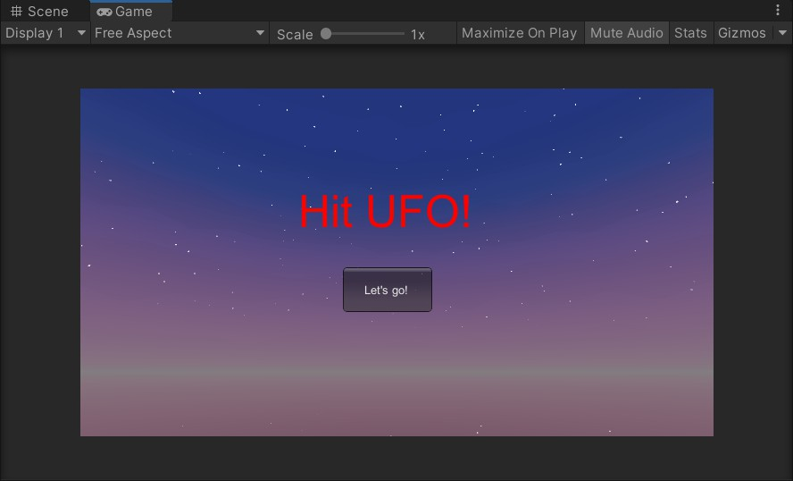

* 游戏开始

    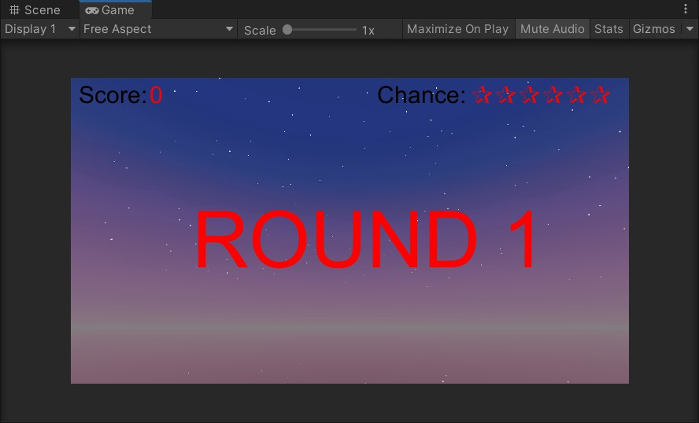

    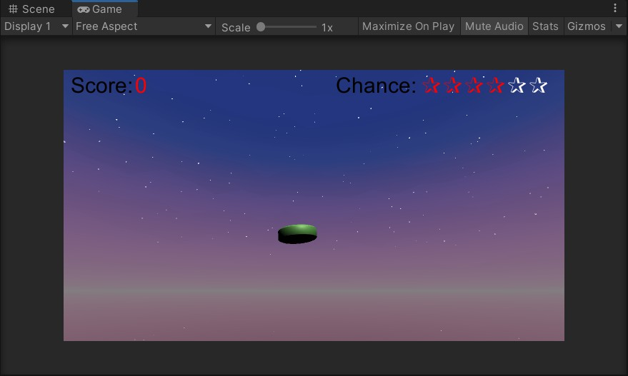

* 爆炸效果

    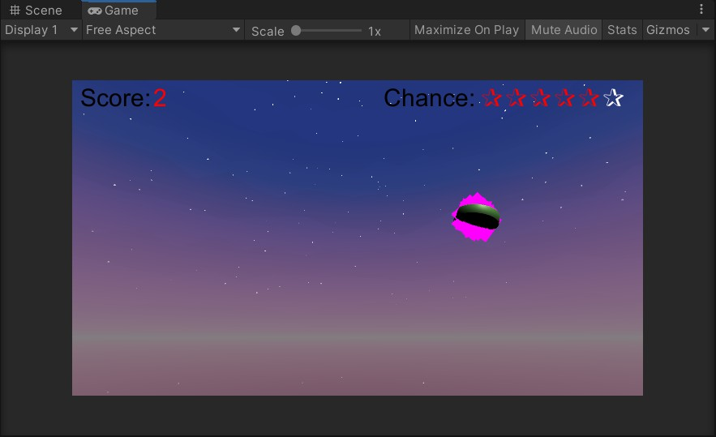

* 游戏结束

    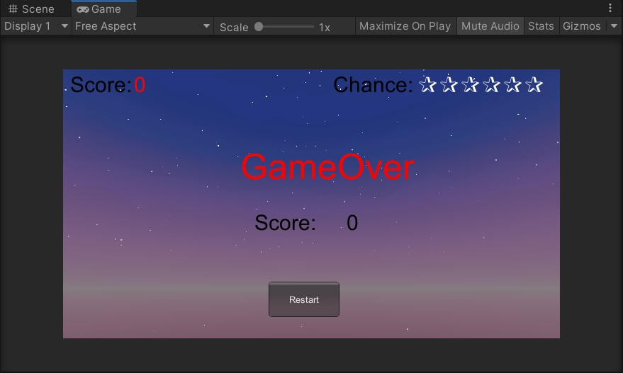

* 得分后游戏结束

    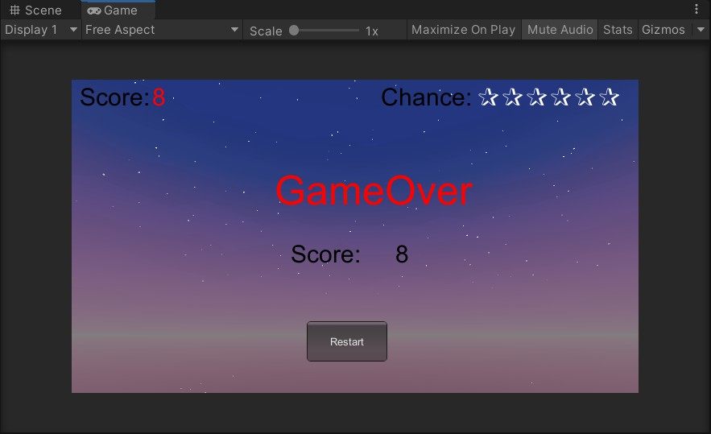

#### 资源传送门

* [代码传送门](./hit-ufo/Assets)