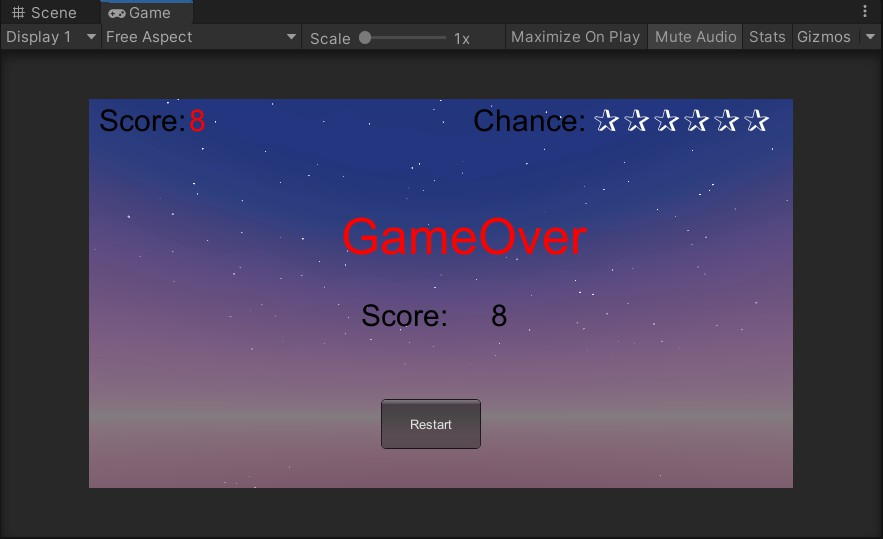

# 3D 游戏编程 ｜物理系统与碰撞 - 作业

## 作业内容

- 改进飞碟（Hit UFO）游戏：
    - 游戏内容要求：
        1. 按 *adapter模式* 设计图修改飞碟游戏
        2. 使它同时支持物理运动与运动学（变换）运动

### 设计游戏

#### 适配器模式

* 适配器模式是将某个类的接口转换成我们所期望的另一个接口，将两个不兼容的类组合在一起使用。适配器起到一种转换和包装的作用。适配器模式主要分为三类：类适配器模式、对象的适配器模式、接口的适配器模式。

* 本次游戏是使用对象的适配器模式，该种适配器模式在本次游戏的UML图如下图

    

#### 适配器实现

* IActionManager

    场景控制器与适配器的接口，场景控制器通过这个接口告诉适配器应该选择哪种实现飞碟飞行动作的方式

    ```c#
    public interface IActionManager
    {
        void playDisk(GameObject disk, float angle, float power,bool isPhy);
    }
    ```

    

* ActionManagerAdapter

    动作管理适配器，这个类继承了IActionManager这个接口，具有物理动作管理器和运动学动作管理器两个属性，当IActionManager接口得知场景控制器需要哪种方式实现飞行的时候，通过一个bool变量来进行选择使用哪个管理器。下面的`isPhy`如果是true则使用物理动作管理器，反之使用运动学动作管理器。

    ```c#
    public class ActionManagerAdapter : MonoBehaviour,IActionManager
    {
        public FlyActionManager action_manager;
        public PhysisFlyActionManager phy_action_manager;
        public void playDisk(GameObject disk, float angle, float power,bool isPhy)
        {
            if(isPhy)
            {
                phy_action_manager.playDisk(disk, angle, power);
            }
            else
            {
                action_manager.playDisk(disk, angle, power);
            }
        }
        // Use this for initialization
        void Start ()
        {
            action_manager = gameObject.AddComponent<FlyActionManager>() as FlyActionManager;
            phy_action_manager = gameObject.AddComponent<PhysisFlyActionManager>() as PhysisFlyActionManager;
        }
    }
    ```

#### 物理动作实现

- PhysisFlyActionManager

    物理的动作管理器，与运动学管理器类似，但含有物理的飞碟飞行动作属性。

    ```c#
    public class PhysisFlyActionManager : SSActionManager
    {
    
        public PhysisUFOFlyAction fly;                            //飞碟飞行的动作
    
        protected void Start()
        {
        }
        //飞碟飞行
        public void UFOFly(GameObject disk, float angle, float power)
        {
            fly = PhysisUFOFlyAction.GetSSAction(disk.GetComponent<DiskData>().direction, angle, power);
            this.RunAction(disk, fly, this);
        }
    }
    ```

- PhysisUFOFlyAction

    物理的飞碟飞行动作，使用`Rigidbody`给飞碟添加重力和给一个初速度向量，实现飞碟飞行

    ```c#
    public class PhysisUFOFlyAction : SSAction
    {
        private Vector3 start_vector;                              //初速度向量
        public float power;
        private PhysisUFOFlyAction() { }
        public static PhysisUFOFlyAction GetSSAction(Vector3 direction, float angle, float power)
        {
            //初始化物体将要运动的初速度向量
            PhysisUFOFlyAction action = CreateInstance<PhysisUFOFlyAction>();
            if (direction.x == -1)
            {
                action.start_vector = Quaternion.Euler(new Vector3(0, 0, -angle)) * Vector3.left * power;
            }
            else
            {
                action.start_vector = Quaternion.Euler(new Vector3(0, 0, angle)) * Vector3.right * power;
            }
            action.power = power;
            return action;
        }
    
        public override void FixedUpdate()
        {
            //判断是否超出范围
            if (this.transform.position.y < -10)
            {
                this.destroy = true;
                this.callback.SSActionEvent(this);
            }
        }
        public override void Update() { }
        public override void Start()
        {
            //使用重力以及给一个初速度
            gameobject.GetComponent<Rigidbody>().velocity = power / 35 * start_vector;
            gameobject.GetComponent<Rigidbody>().useGravity = true;
        }
    }
    ```

- SSActionManager

    动作管理器，管理Action List中的每个Action。SSActionManager调用SSAction的`FixedUpdate`和`Update`，从而实现运动学动作和物理学动作兼容，下面是SSActionManager的部分代码

    - FixedUpdate
        在固定的时间间隔内执行此方法，不受游戏帧率的影响，所以处理`Rigidbody`的时候最好使用FixedUpdate。
    - Update
        在每一帧的时候调用，不同设备渲染帧的时间不同，所以每次执行Update的时候相隔的时间是不一定的。

    ```c#
    protected void Update()
    {
        foreach (SSAction ac in waitingAdd)
        {
            actions[ac.GetInstanceID()] = ac;                                    
        }
        waitingAdd.Clear();
    
        foreach (KeyValuePair<int, SSAction> kv in actions)
        {
            SSAction ac = kv.Value;
            if (ac.destroy)         
            {
                waitingDelete.Add(ac.GetInstanceID());
            }
            else if (ac.enable)
            {
                //运动学运动更新
                ac.Update();
            }
        }
    
        foreach (int key in waitingDelete)
        {
            SSAction ac = actions[key];
            actions.Remove(key);
            DestroyObject(ac);
        }
        waitingDelete.Clear();
    }
    protected void FixedUpdate()
    {
        foreach (SSAction ac in waitingAdd)
        {
            actions[ac.GetInstanceID()] = ac;
        }
        waitingAdd.Clear();
    
        foreach (KeyValuePair<int, SSAction> kv in actions)
        {
            SSAction ac = kv.Value;
            if (ac.destroy)
            {
                waitingDelete.Add(ac.GetInstanceID());
            }
            else if (ac.enable)
            {
                //物理运动更新
                ac.FixedUpdate();
            }
        }
    
        foreach (int key in waitingDelete)
        {
            SSAction ac = actions[key];
            actions.Remove(key);
            DestroyObject(ac);
        }
        waitingDelete.Clear();
    }
    ```

#### 场景控制器实现

- FirstController

    在以前的场景控制器中添加`public bool isPhy = false;`属性，这样就可以在Inspector中设置使用哪一种动作管理器，下面是FirstController部分代码

    ```c#
    public bool isPhy = ture;            //是否使用物理运动管理器
    public IActionManager action_manager; //运动管理器接口
    
    void Start()
    {
        SSDirector director = SSDirector.GetInstance();
        director.CurrentScenceController = this;
        disk_factory = Singleton<DiskFactory>.Instance;
        score_recorder = Singleton<ScoreRecorder>.Instance;
        //初始化接口类
        action_manager = gameObject.AddComponent<ActionManagerAdapter>() as IActionManager;
        user_gui = gameObject.AddComponent<UserGUI>() as UserGUI;
    }
    
    private void SendDisk()
    {
        float position_x = 16;
        if (disk_queue.Count != 0)
        {
            GameObject disk = disk_queue.Dequeue();
            disk_notshot.Add(disk);
            disk.SetActive(true);
            float ran_y = Random.Range(1f, 4f);
            float ran_x = Random.Range(-1f, 1f) < 0 ? -1 : 1;
            disk.GetComponent<DiskData>().direction = new Vector3(ran_x, ran_y, 0);
            Vector3 position = new Vector3(-disk.GetComponent<DiskData>().direction.x * position_x, ran_y, 0);
            disk.transform.position = position;
            float power = Random.Range(14f, 16f);
            float angle = Random.Range(20f, 25f);
            //使用接口调用对应方法
            action_manager.playDisk(disk, angle, power,isPhy);
        }
        for (int i = 0; i < disk_notshot.Count; i++)
        {
            GameObject temp = disk_notshot[i];
            if (temp.transform.position.y < -10 && temp.gameObject.activeSelf == true)
            {
                disk_factory.FreeDisk(disk_notshot[i]);
                disk_notshot.Remove(disk_notshot[i]);
                user_gui.ReduceBlood();
            }
        }
    }
    ```


### 测试运行

* [Gitee Kian hit-ufo.gif](./imgs/02.gif)

* 

* 游戏初始化界面

    

* 游戏开始

    

    

* 爆炸效果

    

* 游戏结束

    

* 得分后游戏结束

    

#### 资源传送门

* [代码传送门](./hit-ufo/Assets)