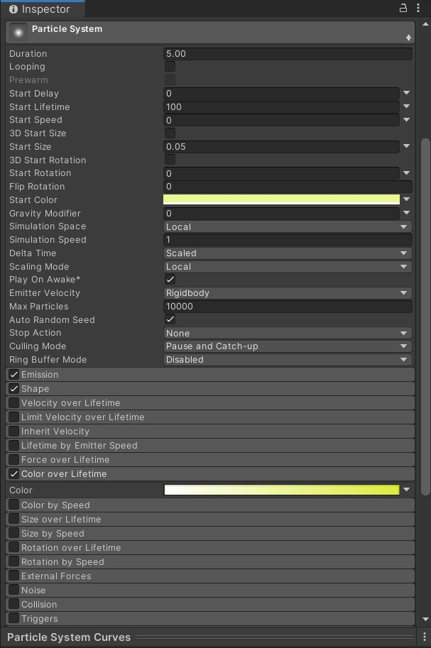
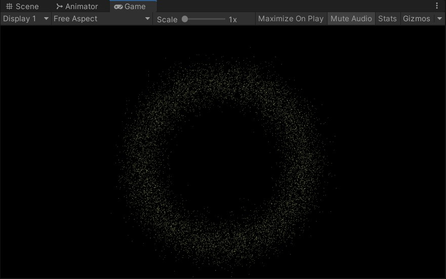
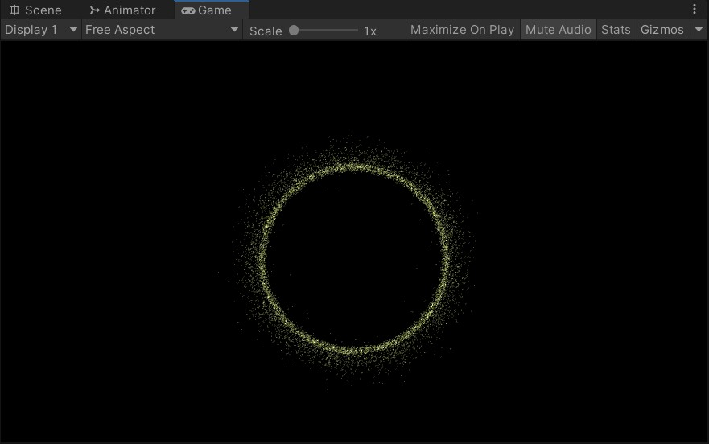

# 3D 游戏编程 ｜粒子系统与流动效果

## 作业内容

参考 http://i-remember.fr/en 这类网站，使用粒子流编程控制制作一些效果， 如“粒子光环”

## 游戏设计

[GIF](./imgs/01.gif)


### 创建粒子系统

创建一个空对象，命名为 ParticleCycle，在空对象中创建一个粒子系统

配置粒子系统的属性如下



### 编写脚本

创建 Partcle 类，设置其成员变量。particle类的成员变量有两种，公有成员可以在界面上进行调控，私有成员进行内部的逻辑运算。

```C#
    public ParticleSystem particleSystem;
    public Camera camera;
    public int particleNum = 10000;      // 粒子数目
    public float minRadius = 5.0f;       // 光环最小半径
    public float maxRadius = 10.0f;      // 光环最大半径

    private ParticleSystem.Particle[] particles;
    private float[] particleAngle;       // 粒子角度
    private float[] particleR;           // 粒子半径
    private int speedLevel = 5;          // 粒子旋转速度水平
    private float particleSpeed = 0.1f;  // 粒子旋转速度
    private RaycastHit hit;

    private float[] before;              // 收缩前粒子位置
    private float[] after;               // 收缩后粒子位置
    private float shrinkSpeed = 4f;      // 粒子缩放的速度
    private bool ischange = false;
```

Start 函数进行初始化，配置粒子系统进行赋值，粒子在初始化的时候都设定好收缩前和收缩后的粒子半径。

```C#
void Start () {
    particleAngle = new float[particleNum];
    particleR = new float[particleNum];
    before = new float[particleNum];
    after = new float[particleNum];
    particles = new ParticleSystem.Particle[particleNum];

    particleSystem.maxParticles = particleNum;
    particleSystem.Emit(particleNum);
    particleSystem.GetParticles(particles);

    CirclePosition cp = new CirclePosition();

    // 每个粒子在初始化的时候都设定好收缩前和收缩后的粒子半径
    for (int i = 0; i < particleNum; i++)
    {
        float r = (float)cp.getNormalDistribution((minRadius+maxRadius)*0.5f, 1);
        float angle = UnityEngine.Random.Range(0.0f, 360.0f);
        particleAngle[i] = angle;
        particleR[i] = r;

        before[i] = r;
        after[i] = 0.7f * r;

        if (after[i] < minRadius * 1.1f)
        {
            float midRadius = minRadius * 1.05f;
            after[i] = UnityEngine.Random.Range(UnityEngine.Random.Range(minRadius, midRadius), (minRadius * 1.1f));
        }
    }
}
```

利用利用正太分布随机数函数来初始化粒子的半径，使得粒子集中在平均半径附近

```c#
class CirclePosition{
    System.Random rand = new System.Random();
    public double getNormalDistribution(double mean, double stdDev)
    {
        double u1 = 1.0 - rand.NextDouble(); //uniform(0,1] random doubles
        double u2 = 1.0 - rand.NextDouble();
        double randStdNormal = Math.Sqrt(-2.0 * Math.Log(u1)) *
                     Math.Sin(2.0 * Math.PI * u2); //random normal(0,1)
        double randNormal = mean + stdDev * randStdNormal; //random normal(mean,stdDev^2)
        return randNormal;
    }
}
```

Update 函数中，更新所有粒子的位置，实现粒子的动态化。

判断索引的奇偶来随机设置一半粒子顺时针运动，另一半逆时针运动

```c#
// 通过奇偶控制粒子顺时针或逆时针旋转 
if (i % 2 == 0)  
{  
    // 逆时针
    particleAngle[i] += (i % speedLevel + 1) * particleSpeed;  
}  
else  
{  
    // 顺时针
    particleAngle[i] -= (i % speedLevel + 1) * particleSpeed;  
}
```

同时利用不同速度级别和基本旋转速度的乘积，来实现粒子以不同速度旋转。

```c#
particleAngle[i] = particleAngle[i] % 360;
// 转换为弧度制
float rad = particleAngle[i] / 180 * Mathf.PI;  

// 更新粒子坐标
particles[i].position = new Vector3(particleR[i] * Mathf.Cos(rad), particleR[i] * Mathf.Sin(rad), 0f); 
```

变量 ischange 确定现在是扩展状态还是收缩状态

```c#
    if (Physics.Raycast(camera.ScreenPointToRay(Input.mousePosition), out hit) && hit.collider.gameObject.tag == "button") ischange = true;  
    else ischange = false;  
```

改变粒子的运动半径来实现拓展和收缩

```c#
if (ischange)
{
    // 开始收缩
    if(particleR[i] > after[i])
    {
        particleR[i] -= shrinkSpeed * (particleR[i] / after[i]) * Time.deltaTime;
    }
}
else
{
    // 开始还原
    if (particleR[i] < before[i])
    {
        particleR[i] += shrinkSpeed * (before[i] / particleR[i]) * Time.deltaTime;
    }
    else if (particleR[i] > before[i])
    {
        particleR[i] = before[i];
    }
}
```

### 运行效果






[代码传送门](./Particle/)